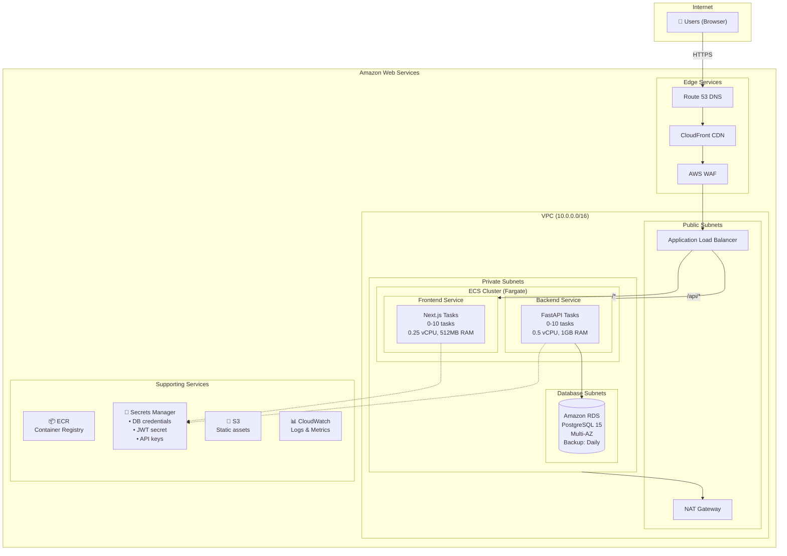
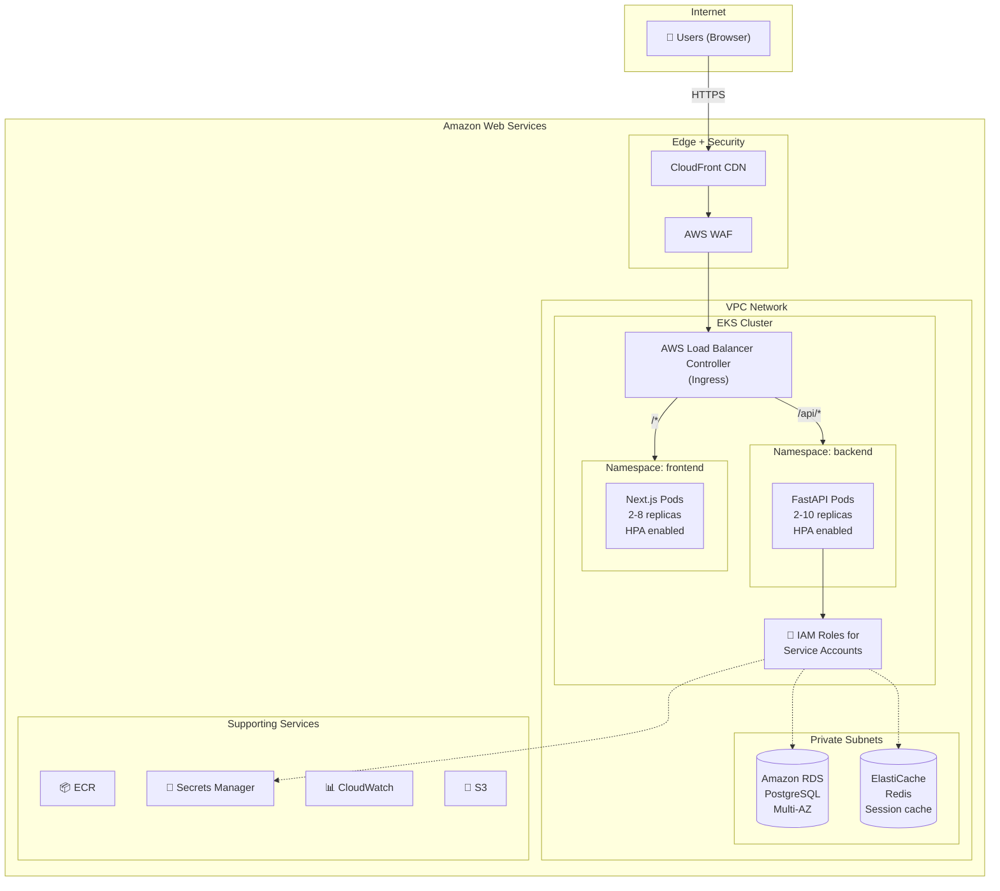
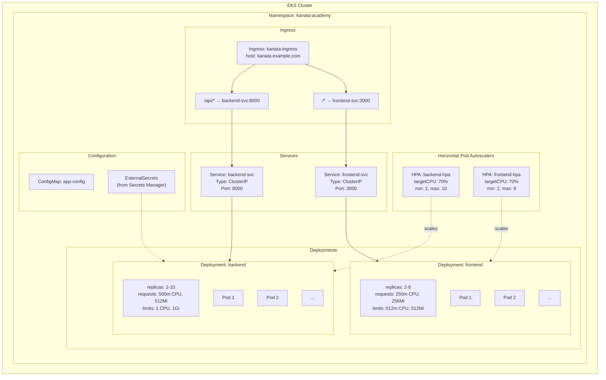
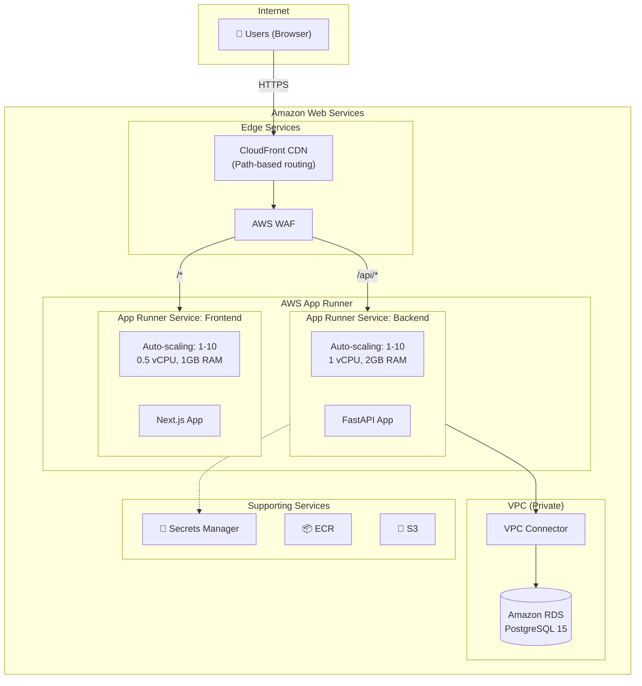

# KanataMusicAcademy - AWS Architecture Design

## Executive Summary

This document presents three Amazon Web Services (AWS) architecture options for deploying the KanataMusicAcademy application, a music school management system consisting of a FastAPI backend and Next.js frontend with PostgreSQL database.

**Recommendation: Architecture 1 - AWS Fargate (Serverless Containers)** is the recommended approach for this application, providing the optimal balance of cost-efficiency, operational simplicity, and scalability for a small-to-medium business application.

---

## Application Profile

### Technology Stack
| Component | Technology | Version |
|-----------|------------|---------|
| Backend | FastAPI (Python) | 3.x |
| Frontend | Next.js | 16.1.6 |
| Database | PostgreSQL | 15+ |
| Authentication | JWT + bcrypt | - |
| UI Framework | React + Tailwind CSS | 19.x / 4.x |

### Application Characteristics
- **Traffic Pattern**: Variable, business hours peak (9 AM - 9 PM), low overnight
- **User Base**: Small-to-medium (50-500 concurrent users max)
- **Data Sensitivity**: Contains PII (student/teacher info, payment data)
- **Availability Requirement**: 99.5% uptime sufficient
- **Compliance**: Standard data protection practices

### Core Modules
1. **People Management** - Teachers, students, availability
2. **Class Scheduling** - Private/group lessons, calendar
3. **Payments** - Credit-based system, transactions
4. **Inventory** - Products, rentals, sales
5. **Dashboard** - Metrics and reporting
6. **User Administration** - RBAC (Admin/Teacher/Student)

---

## Architecture 1: AWS Fargate (Serverless Containers) - RECOMMENDED

### Overview
Fully serverless container architecture using Amazon ECS with Fargate for both frontend and backend, with Amazon RDS for managed PostgreSQL.

### Architecture Diagram



### Component Details

| Component | AWS Service | Configuration | Purpose |
|-----------|-------------|---------------|---------|
| Frontend | ECS Fargate | 0.25 vCPU, 512MB RAM, 0-10 tasks | Next.js SSR |
| Backend | ECS Fargate | 0.5 vCPU, 1GB RAM, 0-10 tasks | FastAPI API |
| Database | RDS PostgreSQL | db.t3.medium, Multi-AZ, 100GB | Data persistence |
| Load Balancer | Application LB | Path-based routing | Traffic distribution |
| Secrets | Secrets Manager | Automatic rotation | Credentials storage |
| CDN | CloudFront | Static asset caching | Performance |
| Security | AWS WAF | Managed rules, rate limiting | DDoS protection |
| Monitoring | CloudWatch | Logs, metrics, dashboards | Observability |
| Container Registry | ECR | Docker images | CI/CD integration |

### Estimated Monthly Cost

| Resource | Specification | Monthly Cost (USD) |
|----------|--------------|-------------------|
| ECS Fargate (Backend) | 2M requests, avg 200ms | $20-45 |
| ECS Fargate (Frontend) | 1M requests, avg 100ms | $15-30 |
| RDS PostgreSQL | db.t3.medium, Multi-AZ, 100GB | $130-160 |
| Application Load Balancer | + data processing | $25-35 |
| CloudFront | 50GB egress | $5-10 |
| AWS WAF | Standard rules | $10 |
| Secrets Manager | 5 secrets | $2 |
| ECR | 10GB storage | $1 |
| CloudWatch | Logs + metrics | $10 |
| NAT Gateway | Per-hour + data | $35-45 |
| **Total** | | **$253-348/month** |

### Pros
- **Cost-efficient**: Pay-per-use, scales based on actual demand
- **Zero infrastructure management**: No EC2 instances to maintain
- **Automatic scaling**: Application Auto Scaling handles traffic spikes
- **Fast deployments**: Simple container-based CI/CD
- **AWS Ecosystem**: Deep integration with all AWS services

### Cons
- **NAT Gateway cost**: Fixed cost for outbound internet access
- **Cold start latency**: 10-30 second task startup (mitigatable with min tasks)
- **Complexity**: More components than App Runner

---

## Architecture 2: Amazon EKS (Kubernetes)

### Overview
Container orchestration platform using Amazon EKS with Fargate or managed node groups, providing more control and flexibility than ECS.

### Architecture Diagram



### Kubernetes Resource Diagram



### Estimated Monthly Cost

| Resource | Specification | Monthly Cost (USD) |
|----------|--------------|-------------------|
| EKS Control Plane | Per cluster | $73 |
| EKS Fargate | ~4 vCPUs, 8GB RAM average | $150-200 |
| RDS PostgreSQL | db.t3.medium, Multi-AZ, 100GB | $130-160 |
| ElastiCache Redis | cache.t3.micro | $15 |
| Application Load Balancer | + data processing | $25-35 |
| CloudFront | 50GB egress | $5-10 |
| AWS WAF | Standard rules | $10 |
| NAT Gateway | Per-hour + data | $35-45 |
| CloudWatch | Enhanced monitoring | $15 |
| **Total** | | **$458-563/month** |

### Pros
- **Kubernetes ecosystem**: Helm, ArgoCD, GitOps support
- **Fine-grained control**: Custom scheduling, affinity rules
- **Multi-environment**: Easy staging/production separation
- **Service mesh ready**: AWS App Mesh or Istio integration
- **Portable**: Kubernetes skills transfer across clouds

### Cons
- **Higher cost**: EKS control plane + minimum node overhead
- **Complexity**: Kubernetes expertise required
- **Management overhead**: More YAML, more moving parts
- **Overkill**: For a single music school application

---

## Architecture 3: AWS App Runner

### Overview
Fully managed container service that automatically builds, deploys, and scales containerized applications. The simplest path to production.

### Architecture Diagram



### Estimated Monthly Cost

| Resource | Specification | Monthly Cost (USD) |
|----------|--------------|-------------------|
| App Runner (Backend) | 1 vCPU, 2GB, active hours | $50-80 |
| App Runner (Frontend) | 0.5 vCPU, 1GB, active hours | $30-50 |
| RDS PostgreSQL | db.t3.medium, Multi-AZ, 100GB | $130-160 |
| CloudFront | 50GB egress | $5-10 |
| AWS WAF | Standard rules | $10 |
| VPC Connector | Per-hour | $15 |
| Secrets Manager | 5 secrets | $2 |
| **Total** | | **$242-327/month** |

### Pros
- **Extreme simplicity**: Connect repo and deploy
- **Automatic HTTPS**: Managed TLS certificates
- **Auto-scaling**: Built-in with no configuration
- **Cost-effective**: Scales to near-zero when idle
- **Fast deployments**: Source or image-based

### Cons
- **Limited control**: Cannot customize underlying infrastructure
- **VPC complexity**: Requires connector for private resources
- **No path-based routing**: Need CloudFront for URL routing
- **Newer service**: Fewer features than ECS/EKS

---

## Architecture Comparison Matrix

| Criteria | ECS Fargate | EKS | App Runner |
|----------|-------------|-----|------------|
| **Monthly Cost** | $253-348 | $458-563 | $242-327 |
| **Scalability** | Excellent | Excellent | Good |
| **Scale to Zero** | Yes (with caveats) | No | Yes |
| **Operational Complexity** | Medium | High | Low |
| **Cold Start Latency** | 10-30s | None | 5-15s |
| **Database HA** | Managed | Managed | Managed |
| **Time to Deploy** | Days | Weeks | Hours |
| **Team Expertise Required** | Medium | High (K8s) | Low |
| **Flexibility** | High | Very High | Low |
| **Lock-in Risk** | Medium | Low | High |

---

## Recommended Architecture: ECS Fargate (Architecture 1)

### Justification

**ECS Fargate is the optimal choice for KanataMusicAcademy** for the following reasons:

#### 1. Balance of Simplicity and Control
- **Simpler than EKS**: No Kubernetes expertise needed
- **More control than App Runner**: Fine-grained networking and configuration
- **AWS-native**: Deep integration with CloudWatch, IAM, VPC

#### 2. Cost Efficiency
- **Pay-per-use**: Only charged for running tasks
- **Right-sized**: Can scale down to 1 task during off-hours
- **No control plane cost**: Unlike EKS ($73/month)

#### 3. Operational Simplicity
- **No cluster management**: AWS manages Fargate infrastructure
- **Automatic patching**: No OS updates to manage
- **Built-in service discovery**: AWS Cloud Map integration

#### 4. Enterprise-Ready
- **VPC integration**: Private subnets, security groups
- **IAM roles**: Task-level permissions
- **Secrets integration**: Native Secrets Manager support

#### 5. Mature Ecosystem
- **Well-documented**: Extensive AWS documentation
- **Wide adoption**: Large community and support
- **Tool support**: Terraform, CDK, CloudFormation

### Mitigating ECS Fargate Limitations

| Limitation | Mitigation |
|------------|------------|
| Cold starts | Use minimum task count of 1 during business hours |
| NAT Gateway cost | Use VPC Endpoints for AWS services |
| Complexity | Use AWS Copilot or CDK for simplified deployment |

---

## Detailed Deployment Plan

### Phase 1: Foundation Setup (Day 1-2)

#### 1.1 AWS Account Setup

```bash
# Set environment variables
export AWS_REGION="us-east-1"
export AWS_ACCOUNT_ID=$(aws sts get-caller-identity --query Account --output text)
export PROJECT_NAME="kanata-academy"

# Create resource tags
export TAGS="Key=Project,Value=KanataMusicAcademy Key=Environment,Value=production"
```

#### 1.2 VPC Network Setup

```bash
# Create VPC
VPC_ID=$(aws ec2 create-vpc \
  --cidr-block 10.0.0.0/16 \
  --tag-specifications "ResourceType=vpc,Tags=[{Key=Name,Value=${PROJECT_NAME}-vpc}]" \
  --query 'Vpc.VpcId' --output text)

# Enable DNS hostnames
aws ec2 modify-vpc-attribute --vpc-id $VPC_ID --enable-dns-hostnames

# Create Internet Gateway
IGW_ID=$(aws ec2 create-internet-gateway \
  --tag-specifications "ResourceType=internet-gateway,Tags=[{Key=Name,Value=${PROJECT_NAME}-igw}]" \
  --query 'InternetGateway.InternetGatewayId' --output text)

aws ec2 attach-internet-gateway --vpc-id $VPC_ID --internet-gateway-id $IGW_ID

# Create Public Subnets (2 AZs)
PUBLIC_SUBNET_1=$(aws ec2 create-subnet \
  --vpc-id $VPC_ID \
  --cidr-block 10.0.1.0/24 \
  --availability-zone ${AWS_REGION}a \
  --tag-specifications "ResourceType=subnet,Tags=[{Key=Name,Value=${PROJECT_NAME}-public-1}]" \
  --query 'Subnet.SubnetId' --output text)

PUBLIC_SUBNET_2=$(aws ec2 create-subnet \
  --vpc-id $VPC_ID \
  --cidr-block 10.0.2.0/24 \
  --availability-zone ${AWS_REGION}b \
  --tag-specifications "ResourceType=subnet,Tags=[{Key=Name,Value=${PROJECT_NAME}-public-2}]" \
  --query 'Subnet.SubnetId' --output text)

# Create Private Subnets (2 AZs)
PRIVATE_SUBNET_1=$(aws ec2 create-subnet \
  --vpc-id $VPC_ID \
  --cidr-block 10.0.10.0/24 \
  --availability-zone ${AWS_REGION}a \
  --tag-specifications "ResourceType=subnet,Tags=[{Key=Name,Value=${PROJECT_NAME}-private-1}]" \
  --query 'Subnet.SubnetId' --output text)

PRIVATE_SUBNET_2=$(aws ec2 create-subnet \
  --vpc-id $VPC_ID \
  --cidr-block 10.0.11.0/24 \
  --availability-zone ${AWS_REGION}b \
  --tag-specifications "ResourceType=subnet,Tags=[{Key=Name,Value=${PROJECT_NAME}-private-2}]" \
  --query 'Subnet.SubnetId' --output text)

# Create NAT Gateway
EIP_ALLOC=$(aws ec2 allocate-address --domain vpc --query 'AllocationId' --output text)

NAT_GW=$(aws ec2 create-nat-gateway \
  --subnet-id $PUBLIC_SUBNET_1 \
  --allocation-id $EIP_ALLOC \
  --tag-specifications "ResourceType=natgateway,Tags=[{Key=Name,Value=${PROJECT_NAME}-nat}]" \
  --query 'NatGateway.NatGatewayId' --output text)

# Create Route Tables
PUBLIC_RT=$(aws ec2 create-route-table \
  --vpc-id $VPC_ID \
  --tag-specifications "ResourceType=route-table,Tags=[{Key=Name,Value=${PROJECT_NAME}-public-rt}]" \
  --query 'RouteTable.RouteTableId' --output text)

aws ec2 create-route --route-table-id $PUBLIC_RT --destination-cidr-block 0.0.0.0/0 --gateway-id $IGW_ID
aws ec2 associate-route-table --route-table-id $PUBLIC_RT --subnet-id $PUBLIC_SUBNET_1
aws ec2 associate-route-table --route-table-id $PUBLIC_RT --subnet-id $PUBLIC_SUBNET_2

PRIVATE_RT=$(aws ec2 create-route-table \
  --vpc-id $VPC_ID \
  --tag-specifications "ResourceType=route-table,Tags=[{Key=Name,Value=${PROJECT_NAME}-private-rt}]" \
  --query 'RouteTable.RouteTableId' --output text)

aws ec2 create-route --route-table-id $PRIVATE_RT --destination-cidr-block 0.0.0.0/0 --nat-gateway-id $NAT_GW
aws ec2 associate-route-table --route-table-id $PRIVATE_RT --subnet-id $PRIVATE_SUBNET_1
aws ec2 associate-route-table --route-table-id $PRIVATE_RT --subnet-id $PRIVATE_SUBNET_2
```

#### 1.3 Security Groups

```bash
# ALB Security Group
ALB_SG=$(aws ec2 create-security-group \
  --group-name ${PROJECT_NAME}-alb-sg \
  --description "ALB Security Group" \
  --vpc-id $VPC_ID \
  --query 'GroupId' --output text)

aws ec2 authorize-security-group-ingress --group-id $ALB_SG --protocol tcp --port 80 --cidr 0.0.0.0/0
aws ec2 authorize-security-group-ingress --group-id $ALB_SG --protocol tcp --port 443 --cidr 0.0.0.0/0

# ECS Tasks Security Group
ECS_SG=$(aws ec2 create-security-group \
  --group-name ${PROJECT_NAME}-ecs-sg \
  --description "ECS Tasks Security Group" \
  --vpc-id $VPC_ID \
  --query 'GroupId' --output text)

aws ec2 authorize-security-group-ingress --group-id $ECS_SG --protocol tcp --port 8000 --source-group $ALB_SG
aws ec2 authorize-security-group-ingress --group-id $ECS_SG --protocol tcp --port 3000 --source-group $ALB_SG

# RDS Security Group
RDS_SG=$(aws ec2 create-security-group \
  --group-name ${PROJECT_NAME}-rds-sg \
  --description "RDS Security Group" \
  --vpc-id $VPC_ID \
  --query 'GroupId' --output text)

aws ec2 authorize-security-group-ingress --group-id $RDS_SG --protocol tcp --port 5432 --source-group $ECS_SG
```

#### 1.4 ECR Repositories

```bash
# Create ECR repositories
aws ecr create-repository --repository-name ${PROJECT_NAME}/backend
aws ecr create-repository --repository-name ${PROJECT_NAME}/frontend

# Get ECR login
aws ecr get-login-password --region $AWS_REGION | docker login --username AWS --password-stdin ${AWS_ACCOUNT_ID}.dkr.ecr.${AWS_REGION}.amazonaws.com
```

### Phase 2: Database Setup (Day 2-3)

#### 2.1 RDS Subnet Group

```bash
# Create DB subnet group
aws rds create-db-subnet-group \
  --db-subnet-group-name ${PROJECT_NAME}-db-subnet \
  --db-subnet-group-description "Kanata Academy DB Subnet Group" \
  --subnet-ids $PRIVATE_SUBNET_1 $PRIVATE_SUBNET_2
```

#### 2.2 RDS Instance

```bash
# Generate and store password
DB_PASSWORD=$(openssl rand -base64 32)

aws secretsmanager create-secret \
  --name ${PROJECT_NAME}/db-password \
  --secret-string "$DB_PASSWORD"

# Create RDS instance
aws rds create-db-instance \
  --db-instance-identifier ${PROJECT_NAME}-db \
  --db-instance-class db.t3.medium \
  --engine postgres \
  --engine-version 15 \
  --master-username kanata_admin \
  --master-user-password "$DB_PASSWORD" \
  --allocated-storage 100 \
  --storage-type gp3 \
  --db-subnet-group-name ${PROJECT_NAME}-db-subnet \
  --vpc-security-group-ids $RDS_SG \
  --multi-az \
  --backup-retention-period 7 \
  --preferred-backup-window "02:00-03:00" \
  --preferred-maintenance-window "sun:03:00-sun:04:00" \
  --storage-encrypted \
  --no-publicly-accessible \
  --tags Key=Project,Value=KanataMusicAcademy

# Wait for RDS to be available
aws rds wait db-instance-available --db-instance-identifier ${PROJECT_NAME}-db

# Get RDS endpoint
RDS_ENDPOINT=$(aws rds describe-db-instances \
  --db-instance-identifier ${PROJECT_NAME}-db \
  --query 'DBInstances[0].Endpoint.Address' --output text)
```

#### 2.3 Secrets Manager Setup

```bash
# Store JWT secret
JWT_SECRET=$(openssl rand -base64 64)
aws secretsmanager create-secret \
  --name ${PROJECT_NAME}/jwt-secret \
  --secret-string "$JWT_SECRET"

# Store database URL
aws secretsmanager create-secret \
  --name ${PROJECT_NAME}/database-url \
  --secret-string "postgresql://kanata_admin:${DB_PASSWORD}@${RDS_ENDPOINT}:5432/kanata_academy"
```

### Phase 3: Container Build (Day 3-4)

#### 3.1 Backend Dockerfile

Create `backend/Dockerfile`:

```dockerfile
# Build stage
FROM python:3.11-slim as builder

WORKDIR /app

# Install build dependencies
RUN apt-get update && apt-get install -y \
    gcc \
    libpq-dev \
    && rm -rf /var/lib/apt/lists/*

# Install Python dependencies
COPY requirements.txt .
RUN pip install --no-cache-dir --user -r requirements.txt

# Production stage
FROM python:3.11-slim

WORKDIR /app

# Install runtime dependencies
RUN apt-get update && apt-get install -y \
    libpq5 \
    curl \
    && rm -rf /var/lib/apt/lists/*

# Copy installed packages from builder
COPY --from=builder /root/.local /root/.local
ENV PATH=/root/.local/bin:$PATH

# Copy application code
COPY . .

# Health check
HEALTHCHECK --interval=30s --timeout=3s --start-period=5s --retries=3 \
  CMD curl -f http://localhost:8000/health || exit 1

# Run the application
ENV PORT=8000
EXPOSE 8000

CMD exec uvicorn main:app --host 0.0.0.0 --port $PORT --workers 2
```

#### 3.2 Frontend Dockerfile

Create `frontend/Dockerfile`:

```dockerfile
# Build stage
FROM node:20-alpine AS builder

WORKDIR /app

# Copy package files
COPY package*.json ./

# Install dependencies
RUN npm ci

# Copy application code
COPY . .

# Set production environment
ENV NODE_ENV=production
ENV NEXT_TELEMETRY_DISABLED=1

# Build the application
RUN npm run build

# Production stage
FROM node:20-alpine AS runner

WORKDIR /app

ENV NODE_ENV=production
ENV NEXT_TELEMETRY_DISABLED=1

# Add non-root user
RUN addgroup --system --gid 1001 nodejs
RUN adduser --system --uid 1001 nextjs

# Install curl for health checks
RUN apk add --no-cache curl

# Copy built application
COPY --from=builder /app/public ./public
COPY --from=builder --chown=nextjs:nodejs /app/.next/standalone ./
COPY --from=builder --chown=nextjs:nodejs /app/.next/static ./.next/static

USER nextjs

# Health check
HEALTHCHECK --interval=30s --timeout=3s --start-period=5s --retries=3 \
  CMD curl -f http://localhost:3000/api/health || exit 1

EXPOSE 3000
ENV PORT=3000

CMD ["node", "server.js"]
```

#### 3.3 Build and Push Images

```bash
# Build and push backend
docker build -t ${AWS_ACCOUNT_ID}.dkr.ecr.${AWS_REGION}.amazonaws.com/${PROJECT_NAME}/backend:latest ./backend
docker push ${AWS_ACCOUNT_ID}.dkr.ecr.${AWS_REGION}.amazonaws.com/${PROJECT_NAME}/backend:latest

# Build and push frontend
docker build -t ${AWS_ACCOUNT_ID}.dkr.ecr.${AWS_REGION}.amazonaws.com/${PROJECT_NAME}/frontend:latest ./frontend
docker push ${AWS_ACCOUNT_ID}.dkr.ecr.${AWS_REGION}.amazonaws.com/${PROJECT_NAME}/frontend:latest
```

### Phase 4: ECS Deployment (Day 4-5)

#### 4.1 ECS Cluster

```bash
# Create ECS cluster
aws ecs create-cluster \
  --cluster-name ${PROJECT_NAME}-cluster \
  --capacity-providers FARGATE FARGATE_SPOT \
  --default-capacity-provider-strategy capacityProvider=FARGATE,weight=1
```

#### 4.2 IAM Roles

```bash
# Create task execution role
cat > trust-policy.json << 'EOF'
{
  "Version": "2012-10-17",
  "Statement": [
    {
      "Effect": "Allow",
      "Principal": {
        "Service": "ecs-tasks.amazonaws.com"
      },
      "Action": "sts:AssumeRole"
    }
  ]
}
EOF

aws iam create-role \
  --role-name ${PROJECT_NAME}-task-execution-role \
  --assume-role-policy-document file://trust-policy.json

aws iam attach-role-policy \
  --role-name ${PROJECT_NAME}-task-execution-role \
  --policy-arn arn:aws:iam::aws:policy/service-role/AmazonECSTaskExecutionRolePolicy

# Add Secrets Manager access
cat > secrets-policy.json << EOF
{
  "Version": "2012-10-17",
  "Statement": [
    {
      "Effect": "Allow",
      "Action": [
        "secretsmanager:GetSecretValue"
      ],
      "Resource": [
        "arn:aws:secretsmanager:${AWS_REGION}:${AWS_ACCOUNT_ID}:secret:${PROJECT_NAME}/*"
      ]
    }
  ]
}
EOF

aws iam put-role-policy \
  --role-name ${PROJECT_NAME}-task-execution-role \
  --policy-name SecretsManagerAccess \
  --policy-document file://secrets-policy.json

# Create task role (for application permissions)
aws iam create-role \
  --role-name ${PROJECT_NAME}-task-role \
  --assume-role-policy-document file://trust-policy.json
```

#### 4.3 Task Definitions

Create `backend-task-definition.json`:

```json
{
  "family": "kanata-backend",
  "networkMode": "awsvpc",
  "requiresCompatibilities": ["FARGATE"],
  "cpu": "512",
  "memory": "1024",
  "executionRoleArn": "arn:aws:iam::ACCOUNT_ID:role/kanata-academy-task-execution-role",
  "taskRoleArn": "arn:aws:iam::ACCOUNT_ID:role/kanata-academy-task-role",
  "containerDefinitions": [
    {
      "name": "backend",
      "image": "ACCOUNT_ID.dkr.ecr.REGION.amazonaws.com/kanata-academy/backend:latest",
      "essential": true,
      "portMappings": [
        {
          "containerPort": 8000,
          "protocol": "tcp"
        }
      ],
      "environment": [
        {"name": "ENVIRONMENT", "value": "production"}
      ],
      "secrets": [
        {
          "name": "DATABASE_URL",
          "valueFrom": "arn:aws:secretsmanager:REGION:ACCOUNT_ID:secret:kanata-academy/database-url"
        },
        {
          "name": "JWT_SECRET",
          "valueFrom": "arn:aws:secretsmanager:REGION:ACCOUNT_ID:secret:kanata-academy/jwt-secret"
        }
      ],
      "logConfiguration": {
        "logDriver": "awslogs",
        "options": {
          "awslogs-group": "/ecs/kanata-backend",
          "awslogs-region": "REGION",
          "awslogs-stream-prefix": "ecs"
        }
      },
      "healthCheck": {
        "command": ["CMD-SHELL", "curl -f http://localhost:8000/health || exit 1"],
        "interval": 30,
        "timeout": 5,
        "retries": 3,
        "startPeriod": 60
      }
    }
  ]
}
```

```bash
# Create CloudWatch log groups
aws logs create-log-group --log-group-name /ecs/kanata-backend
aws logs create-log-group --log-group-name /ecs/kanata-frontend

# Register task definitions
aws ecs register-task-definition --cli-input-json file://backend-task-definition.json
aws ecs register-task-definition --cli-input-json file://frontend-task-definition.json
```

#### 4.4 Application Load Balancer

```bash
# Create ALB
ALB_ARN=$(aws elbv2 create-load-balancer \
  --name ${PROJECT_NAME}-alb \
  --subnets $PUBLIC_SUBNET_1 $PUBLIC_SUBNET_2 \
  --security-groups $ALB_SG \
  --scheme internet-facing \
  --type application \
  --query 'LoadBalancers[0].LoadBalancerArn' --output text)

# Create target groups
BACKEND_TG=$(aws elbv2 create-target-group \
  --name ${PROJECT_NAME}-backend-tg \
  --protocol HTTP \
  --port 8000 \
  --vpc-id $VPC_ID \
  --target-type ip \
  --health-check-path /health \
  --health-check-interval-seconds 30 \
  --query 'TargetGroups[0].TargetGroupArn' --output text)

FRONTEND_TG=$(aws elbv2 create-target-group \
  --name ${PROJECT_NAME}-frontend-tg \
  --protocol HTTP \
  --port 3000 \
  --vpc-id $VPC_ID \
  --target-type ip \
  --health-check-path / \
  --health-check-interval-seconds 30 \
  --query 'TargetGroups[0].TargetGroupArn' --output text)

# Create HTTPS listener (requires certificate)
aws elbv2 create-listener \
  --load-balancer-arn $ALB_ARN \
  --protocol HTTPS \
  --port 443 \
  --certificates CertificateArn=$ACM_CERT_ARN \
  --default-actions Type=forward,TargetGroupArn=$FRONTEND_TG

# Add path-based routing rule for API
aws elbv2 create-rule \
  --listener-arn $HTTPS_LISTENER_ARN \
  --priority 10 \
  --conditions Field=path-pattern,Values='/api/*' \
  --actions Type=forward,TargetGroupArn=$BACKEND_TG

# Add rule for /token endpoint
aws elbv2 create-rule \
  --listener-arn $HTTPS_LISTENER_ARN \
  --priority 20 \
  --conditions Field=path-pattern,Values='/token' \
  --actions Type=forward,TargetGroupArn=$BACKEND_TG
```

#### 4.5 ECS Services

```bash
# Create backend service
aws ecs create-service \
  --cluster ${PROJECT_NAME}-cluster \
  --service-name backend \
  --task-definition kanata-backend \
  --desired-count 2 \
  --launch-type FARGATE \
  --network-configuration "awsvpcConfiguration={subnets=[$PRIVATE_SUBNET_1,$PRIVATE_SUBNET_2],securityGroups=[$ECS_SG],assignPublicIp=DISABLED}" \
  --load-balancers "targetGroupArn=$BACKEND_TG,containerName=backend,containerPort=8000" \
  --deployment-configuration "minimumHealthyPercent=100,maximumPercent=200"

# Create frontend service
aws ecs create-service \
  --cluster ${PROJECT_NAME}-cluster \
  --service-name frontend \
  --task-definition kanata-frontend \
  --desired-count 2 \
  --launch-type FARGATE \
  --network-configuration "awsvpcConfiguration={subnets=[$PRIVATE_SUBNET_1,$PRIVATE_SUBNET_2],securityGroups=[$ECS_SG],assignPublicIp=DISABLED}" \
  --load-balancers "targetGroupArn=$FRONTEND_TG,containerName=frontend,containerPort=3000" \
  --deployment-configuration "minimumHealthyPercent=100,maximumPercent=200"
```

### Phase 5: Auto Scaling (Day 5)

```bash
# Register scalable targets
aws application-autoscaling register-scalable-target \
  --service-namespace ecs \
  --resource-id service/${PROJECT_NAME}-cluster/backend \
  --scalable-dimension ecs:service:DesiredCount \
  --min-capacity 1 \
  --max-capacity 10

aws application-autoscaling register-scalable-target \
  --service-namespace ecs \
  --resource-id service/${PROJECT_NAME}-cluster/frontend \
  --scalable-dimension ecs:service:DesiredCount \
  --min-capacity 1 \
  --max-capacity 10

# Create scaling policies
aws application-autoscaling put-scaling-policy \
  --service-namespace ecs \
  --resource-id service/${PROJECT_NAME}-cluster/backend \
  --scalable-dimension ecs:service:DesiredCount \
  --policy-name backend-cpu-scaling \
  --policy-type TargetTrackingScaling \
  --target-tracking-scaling-policy-configuration '{
    "TargetValue": 70.0,
    "PredefinedMetricSpecification": {
      "PredefinedMetricType": "ECSServiceAverageCPUUtilization"
    },
    "ScaleInCooldown": 300,
    "ScaleOutCooldown": 60
  }'
```

### Phase 6: CloudFront & WAF (Day 6)

#### 6.1 CloudFront Distribution

```bash
# Create CloudFront distribution
cat > cloudfront-config.json << 'EOF'
{
  "CallerReference": "kanata-academy-cf",
  "Origins": {
    "Quantity": 1,
    "Items": [
      {
        "Id": "ALB",
        "DomainName": "ALB_DNS_NAME",
        "CustomOriginConfig": {
          "HTTPPort": 80,
          "HTTPSPort": 443,
          "OriginProtocolPolicy": "https-only",
          "OriginSslProtocols": {
            "Quantity": 1,
            "Items": ["TLSv1.2"]
          }
        }
      }
    ]
  },
  "DefaultCacheBehavior": {
    "TargetOriginId": "ALB",
    "ViewerProtocolPolicy": "redirect-to-https",
    "AllowedMethods": {
      "Quantity": 7,
      "Items": ["GET", "HEAD", "OPTIONS", "PUT", "POST", "PATCH", "DELETE"],
      "CachedMethods": {
        "Quantity": 2,
        "Items": ["GET", "HEAD"]
      }
    },
    "CachePolicyId": "658327ea-f89d-4fab-a63d-7e88639e58f6",
    "OriginRequestPolicyId": "216adef6-5c7f-47e4-b989-5492eafa07d3",
    "Compress": true
  },
  "CacheBehaviors": {
    "Quantity": 1,
    "Items": [
      {
        "PathPattern": "/_next/static/*",
        "TargetOriginId": "ALB",
        "ViewerProtocolPolicy": "redirect-to-https",
        "CachePolicyId": "658327ea-f89d-4fab-a63d-7e88639e58f6",
        "Compress": true
      }
    ]
  },
  "Enabled": true,
  "HttpVersion": "http2",
  "PriceClass": "PriceClass_100"
}
EOF

aws cloudfront create-distribution --distribution-config file://cloudfront-config.json
```

#### 6.2 AWS WAF

```bash
# Create WAF Web ACL
aws wafv2 create-web-acl \
  --name ${PROJECT_NAME}-waf \
  --scope CLOUDFRONT \
  --region us-east-1 \
  --default-action Allow={} \
  --rules '[
    {
      "Name": "AWSManagedRulesCommonRuleSet",
      "Priority": 1,
      "Statement": {
        "ManagedRuleGroupStatement": {
          "VendorName": "AWS",
          "Name": "AWSManagedRulesCommonRuleSet"
        }
      },
      "OverrideAction": {"None": {}},
      "VisibilityConfig": {
        "SampledRequestsEnabled": true,
        "CloudWatchMetricsEnabled": true,
        "MetricName": "CommonRuleSet"
      }
    },
    {
      "Name": "AWSManagedRulesSQLiRuleSet",
      "Priority": 2,
      "Statement": {
        "ManagedRuleGroupStatement": {
          "VendorName": "AWS",
          "Name": "AWSManagedRulesSQLiRuleSet"
        }
      },
      "OverrideAction": {"None": {}},
      "VisibilityConfig": {
        "SampledRequestsEnabled": true,
        "CloudWatchMetricsEnabled": true,
        "MetricName": "SQLiRuleSet"
      }
    },
    {
      "Name": "RateLimitRule",
      "Priority": 3,
      "Statement": {
        "RateBasedStatement": {
          "Limit": 2000,
          "AggregateKeyType": "IP"
        }
      },
      "Action": {"Block": {}},
      "VisibilityConfig": {
        "SampledRequestsEnabled": true,
        "CloudWatchMetricsEnabled": true,
        "MetricName": "RateLimitRule"
      }
    }
  ]' \
  --visibility-config SampledRequestsEnabled=true,CloudWatchMetricsEnabled=true,MetricName=KanataWAF
```

### Phase 7: Monitoring & Alerting (Day 7)

#### 7.1 CloudWatch Dashboards

```bash
# Create CloudWatch dashboard
cat > dashboard.json << 'EOF'
{
  "widgets": [
    {
      "type": "metric",
      "properties": {
        "title": "ECS CPU Utilization",
        "metrics": [
          ["AWS/ECS", "CPUUtilization", "ClusterName", "kanata-academy-cluster", "ServiceName", "backend"],
          ["...", "frontend"]
        ],
        "period": 300,
        "stat": "Average"
      }
    },
    {
      "type": "metric",
      "properties": {
        "title": "ALB Request Count",
        "metrics": [
          ["AWS/ApplicationELB", "RequestCount", "LoadBalancer", "ALB_ARN"]
        ],
        "period": 60,
        "stat": "Sum"
      }
    },
    {
      "type": "metric",
      "properties": {
        "title": "RDS CPU",
        "metrics": [
          ["AWS/RDS", "CPUUtilization", "DBInstanceIdentifier", "kanata-academy-db"]
        ],
        "period": 300,
        "stat": "Average"
      }
    },
    {
      "type": "metric",
      "properties": {
        "title": "ALB Target Response Time",
        "metrics": [
          ["AWS/ApplicationELB", "TargetResponseTime", "LoadBalancer", "ALB_ARN"]
        ],
        "period": 60,
        "stat": "p99"
      }
    }
  ]
}
EOF

aws cloudwatch put-dashboard --dashboard-name ${PROJECT_NAME}-dashboard --dashboard-body file://dashboard.json
```

#### 7.2 CloudWatch Alarms

```bash
# High CPU alarm
aws cloudwatch put-metric-alarm \
  --alarm-name ${PROJECT_NAME}-backend-high-cpu \
  --alarm-description "Backend CPU > 80%" \
  --metric-name CPUUtilization \
  --namespace AWS/ECS \
  --dimensions Name=ClusterName,Value=${PROJECT_NAME}-cluster Name=ServiceName,Value=backend \
  --statistic Average \
  --period 300 \
  --threshold 80 \
  --comparison-operator GreaterThanThreshold \
  --evaluation-periods 2 \
  --alarm-actions arn:aws:sns:${AWS_REGION}:${AWS_ACCOUNT_ID}:${PROJECT_NAME}-alerts

# High error rate alarm
aws cloudwatch put-metric-alarm \
  --alarm-name ${PROJECT_NAME}-alb-5xx-errors \
  --alarm-description "ALB 5xx errors > 5%" \
  --metric-name HTTPCode_Target_5XX_Count \
  --namespace AWS/ApplicationELB \
  --dimensions Name=LoadBalancer,Value=$ALB_ARN \
  --statistic Sum \
  --period 300 \
  --threshold 50 \
  --comparison-operator GreaterThanThreshold \
  --evaluation-periods 2 \
  --alarm-actions arn:aws:sns:${AWS_REGION}:${AWS_ACCOUNT_ID}:${PROJECT_NAME}-alerts

# RDS CPU alarm
aws cloudwatch put-metric-alarm \
  --alarm-name ${PROJECT_NAME}-rds-high-cpu \
  --alarm-description "RDS CPU > 80%" \
  --metric-name CPUUtilization \
  --namespace AWS/RDS \
  --dimensions Name=DBInstanceIdentifier,Value=${PROJECT_NAME}-db \
  --statistic Average \
  --period 300 \
  --threshold 80 \
  --comparison-operator GreaterThanThreshold \
  --evaluation-periods 2 \
  --alarm-actions arn:aws:sns:${AWS_REGION}:${AWS_ACCOUNT_ID}:${PROJECT_NAME}-alerts
```

### Phase 8: CI/CD Pipeline (Day 8)

#### 8.1 GitHub Actions

Create `.github/workflows/deploy-aws.yml`:

```yaml
name: Deploy to AWS

on:
  push:
    branches: [main, develop]
  pull_request:
    branches: [main]

env:
  AWS_REGION: us-east-1
  ECR_REGISTRY: ${{ secrets.AWS_ACCOUNT_ID }}.dkr.ecr.us-east-1.amazonaws.com
  ECS_CLUSTER: kanata-academy-cluster

jobs:
  test:
    runs-on: ubuntu-latest
    steps:
      - uses: actions/checkout@v4

      - name: Set up Python
        uses: actions/setup-python@v5
        with:
          python-version: '3.11'

      - name: Install backend dependencies
        run: |
          cd backend
          pip install -r requirements.txt
          pip install pytest pytest-cov

      - name: Run backend tests
        run: |
          cd backend
          pytest tests/ -v --cov=.

      - name: Set up Node.js
        uses: actions/setup-node@v4
        with:
          node-version: '20'
          cache: 'npm'
          cache-dependency-path: frontend/package-lock.json

      - name: Install frontend dependencies
        run: |
          cd frontend
          npm ci

      - name: Run frontend lint
        run: |
          cd frontend
          npm run lint

      - name: Build frontend
        run: |
          cd frontend
          npm run build

  deploy:
    needs: test
    if: github.ref == 'refs/heads/main' || github.ref == 'refs/heads/develop'
    runs-on: ubuntu-latest

    permissions:
      id-token: write
      contents: read

    steps:
      - uses: actions/checkout@v4

      - name: Configure AWS credentials
        uses: aws-actions/configure-aws-credentials@v4
        with:
          role-to-assume: ${{ secrets.AWS_ROLE_ARN }}
          aws-region: ${{ env.AWS_REGION }}

      - name: Login to Amazon ECR
        uses: aws-actions/amazon-ecr-login@v2

      - name: Build and push backend
        run: |
          docker build -t $ECR_REGISTRY/kanata-academy/backend:${{ github.sha }} -f backend/Dockerfile ./backend
          docker push $ECR_REGISTRY/kanata-academy/backend:${{ github.sha }}

      - name: Build and push frontend
        run: |
          docker build -t $ECR_REGISTRY/kanata-academy/frontend:${{ github.sha }} -f frontend/Dockerfile ./frontend
          docker push $ECR_REGISTRY/kanata-academy/frontend:${{ github.sha }}

      - name: Update backend service
        run: |
          aws ecs update-service \
            --cluster $ECS_CLUSTER \
            --service backend \
            --force-new-deployment

      - name: Update frontend service
        run: |
          aws ecs update-service \
            --cluster $ECS_CLUSTER \
            --service frontend \
            --force-new-deployment

      - name: Wait for deployment
        run: |
          aws ecs wait services-stable \
            --cluster $ECS_CLUSTER \
            --services backend frontend
```

---

## Post-Deployment Checklist

### Functionality Verification
- [ ] Frontend loads at https://kanata-academy.com
- [ ] API responds at https://kanata-academy.com/api/
- [ ] Authentication (/token endpoint) works
- [ ] Database connections successful
- [ ] All CRUD operations functional

### Security Verification
- [ ] HTTPS enforced (HTTP redirects to HTTPS)
- [ ] SSL certificate valid
- [ ] WAF rules active
- [ ] Secrets Manager accessible only by ECS tasks
- [ ] Security groups properly restrict traffic

### Monitoring Verification
- [ ] CloudWatch Logs receiving logs
- [ ] CloudWatch dashboards showing metrics
- [ ] Alarms configured
- [ ] SNS notifications tested

### Backup Verification
- [ ] RDS automated backups enabled
- [ ] Point-in-time recovery enabled
- [ ] Manual snapshot tested

---

## Cost Optimization Tips

1. **Use Fargate Spot**: Mix Spot capacity for non-critical workloads (up to 70% savings)
2. **Reserved Instances**: Consider RDS Reserved Instances (30-60% savings)
3. **VPC Endpoints**: Reduce NAT Gateway costs by using VPC endpoints for AWS services
4. **Right-size tasks**: Monitor and adjust Fargate CPU/memory based on actual usage
5. **Scheduled scaling**: Scale down to 1 task during off-hours
6. **CloudFront caching**: Maximize cache hit ratio to reduce origin requests

---

## Disaster Recovery

### RTO/RPO Targets
- **RTO (Recovery Time Objective)**: 1 hour
- **RPO (Recovery Point Objective)**: 5 minutes (point-in-time recovery)

### Recovery Procedures

1. **Application failure**: ECS automatically replaces failed tasks
2. **Database failure**: Multi-AZ automatic failover (60-120 seconds)
3. **Region failure**: Deploy to alternate region using stored container images
4. **Data corruption**: Restore from point-in-time backup

### Backup Schedule
- **Database**: Continuous transaction log + daily automated backup (retained 7 days)
- **Container images**: Stored in ECR with immutable tags
- **Configuration**: Infrastructure as Code in version control

---

## Appendix: Environment Variables

### Backend Service
| Variable | Source | Description |
|----------|--------|-------------|
| `DATABASE_URL` | Secrets Manager | PostgreSQL connection string |
| `JWT_SECRET` | Secrets Manager | JWT signing key |
| `ENVIRONMENT` | Task Definition | `production` or `staging` |
| `CORS_ORIGINS` | Task Definition | Allowed CORS origins |

### Frontend Service
| Variable | Source | Description |
|----------|--------|-------------|
| `NEXT_PUBLIC_API_URL` | Task Definition | Backend API URL |
| `NODE_ENV` | Docker build | `production` |

---

*Document Version: 1.0*
*Last Updated: 2026-03-22*
*Author: Claude Code (Cloud Architect)*
