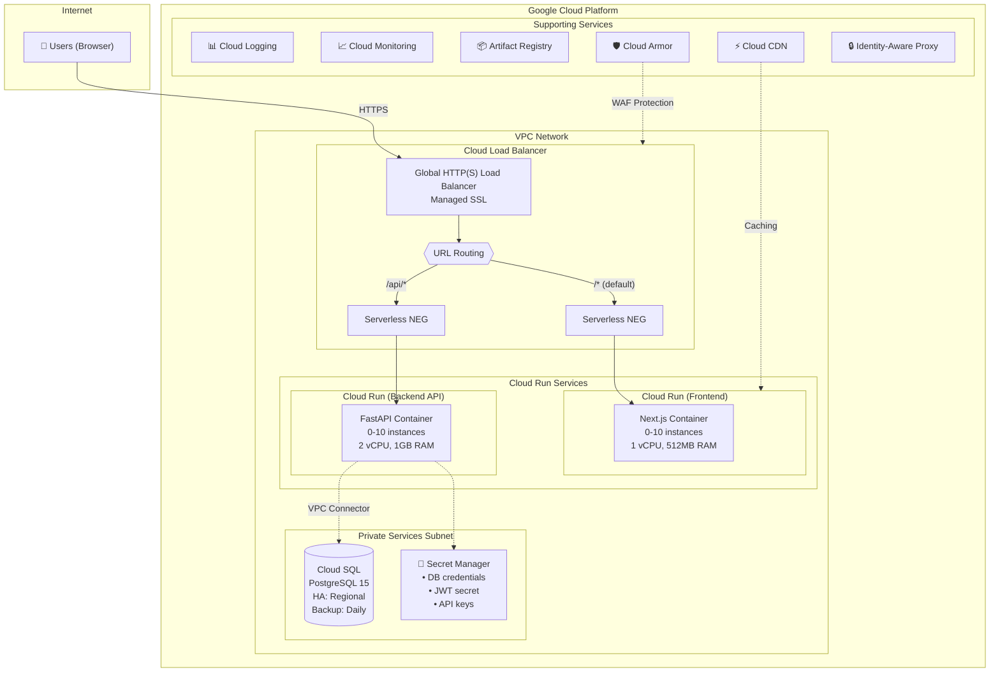
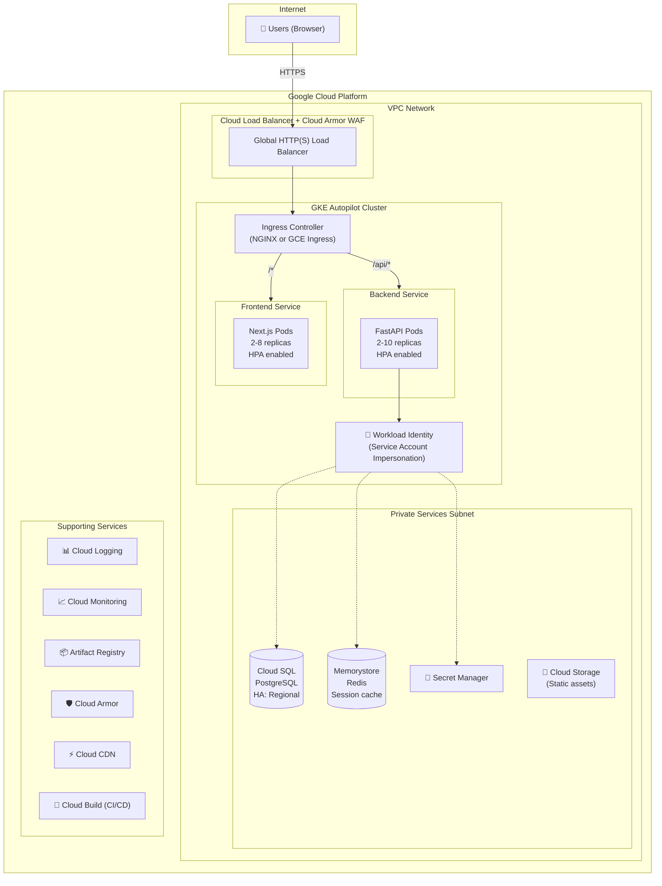
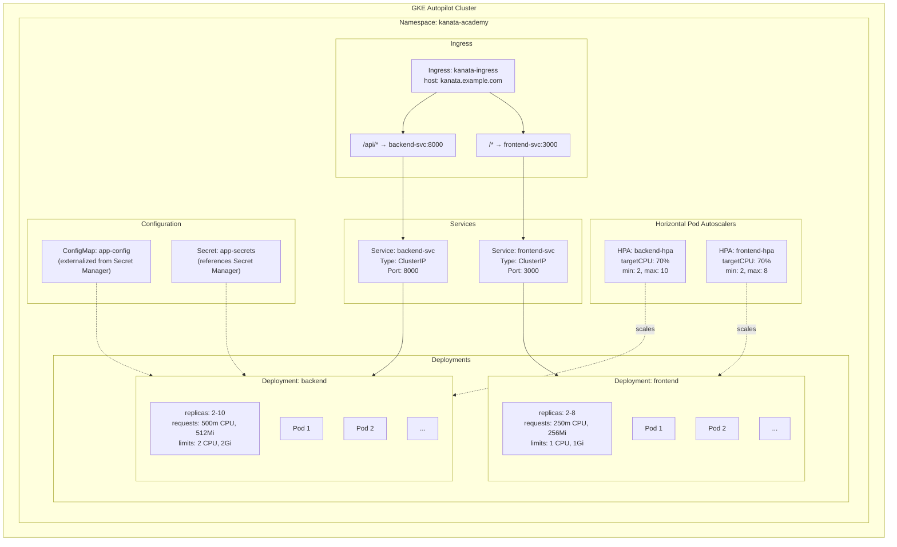
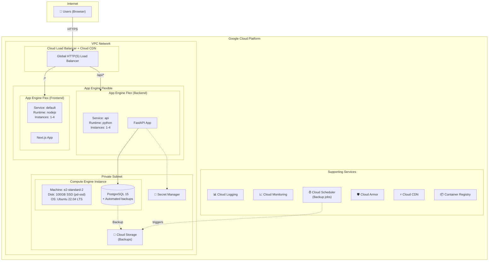

# KanataMusicAcademy - GCP Architecture Design

## Executive Summary

This document presents three Google Cloud Platform (GCP) architecture options for deploying the KanataMusicAcademy application, a music school management system consisting of a FastAPI backend and Next.js frontend with PostgreSQL database.

**Recommendation: Architecture 1 - Cloud Run (Serverless)** is the recommended approach for this application, providing the optimal balance of cost-efficiency, operational simplicity, and scalability for a small-to-medium business application.

---

## Application Profile

### Technology Stack
| Component | Technology | Version |
|-----------|------------|---------|
| Backend | FastAPI (Python) | 3.x |
| Frontend | Next.js | 16.1.6 |
| Database | PostgreSQL | 15+ |
| Authentication | JWT + bcrypt | - |
| UI Framework | React + Tailwind CSS | 19.x / 4.x |

### Application Characteristics
- **Traffic Pattern**: Variable, business hours peak (9 AM - 9 PM), low overnight
- **User Base**: Small-to-medium (50-500 concurrent users max)
- **Data Sensitivity**: Contains PII (student/teacher info, payment data)
- **Availability Requirement**: 99.5% uptime sufficient
- **Compliance**: Standard data protection practices

### Core Modules
1. **People Management** - Teachers, students, availability
2. **Class Scheduling** - Private/group lessons, calendar
3. **Payments** - Credit-based system, transactions
4. **Inventory** - Products, rentals, sales
5. **Dashboard** - Metrics and reporting
6. **User Administration** - RBAC (Admin/Teacher/Student)

---

## Architecture 1: Cloud Run (Serverless) - RECOMMENDED

### Overview
Fully serverless architecture using Cloud Run for both frontend and backend, with Cloud SQL for managed PostgreSQL.

### Architecture Diagram



### Component Details

| Component | GCP Service | Configuration | Purpose |
|-----------|-------------|---------------|---------|
| Frontend | Cloud Run | 1 vCPU, 512MB RAM, 0-10 instances | Next.js SSR |
| Backend | Cloud Run | 2 vCPU, 1GB RAM, 0-10 instances | FastAPI API |
| Database | Cloud SQL PostgreSQL | db-custom-2-4096, HA enabled | Data persistence |
| Load Balancer | Global HTTP(S) LB | Managed SSL, URL routing | Traffic distribution |
| Secrets | Secret Manager | Automatic rotation | Credentials storage |
| CDN | Cloud CDN | Static asset caching | Performance |
| Security | Cloud Armor | WAF rules, rate limiting | DDoS protection |
| Monitoring | Cloud Monitoring + Logging | Dashboards, alerts | Observability |
| Container Registry | Artifact Registry | Docker images | CI/CD integration |

### Estimated Monthly Cost

| Resource | Specification | Monthly Cost (USD) |
|----------|--------------|-------------------|
| Cloud Run (Backend) | 2M requests, avg 200ms | $15-40 |
| Cloud Run (Frontend) | 1M requests, avg 100ms | $10-25 |
| Cloud SQL | db-custom-2-4096, HA, 100GB | $120-150 |
| Cloud Load Balancer | 5 forwarding rules | $25 |
| Cloud Armor | Standard tier | $5 |
| Cloud CDN | 50GB egress | $5 |
| Secret Manager | 5 secrets | $1 |
| Artifact Registry | 10GB storage | $1 |
| Cloud Logging | 10GB/month | $5 |
| **Total** | | **$187-257/month** |

### Pros
- **Cost-efficient**: Pay-per-use, scales to zero during off-hours
- **Zero infrastructure management**: No VMs or clusters to maintain
- **Automatic scaling**: Handles traffic spikes automatically
- **Fast deployments**: Simple container-based CI/CD
- **Built-in security**: Managed SSL, Cloud Armor integration

### Cons
- **Cold start latency**: 1-3 second initial request delay (mitigatable)
- **Limited long-running tasks**: 60-minute max request timeout
- **Less control**: Cannot customize underlying infrastructure

---

## Architecture 2: Google Kubernetes Engine (GKE)

### Overview
Container orchestration platform using GKE Autopilot for managed Kubernetes, providing more control and flexibility than Cloud Run.

### Architecture Diagram



### Kubernetes Resource Diagram



### Estimated Monthly Cost

| Resource | Specification | Monthly Cost (USD) |
|----------|--------------|-------------------|
| GKE Autopilot | ~4 vCPUs, 8GB RAM average | $150-200 |
| Cloud SQL | db-custom-2-4096, HA, 100GB | $120-150 |
| Memorystore (Redis) | Basic, 1GB | $35 |
| Cloud Load Balancer | Ingress + 5 rules | $25 |
| Cloud Armor | Standard tier | $5 |
| Cloud CDN | 50GB egress | $5 |
| Cloud Storage | 10GB static assets | $1 |
| Secret Manager | 5 secrets | $1 |
| Artifact Registry | 10GB storage | $1 |
| Cloud Logging | 15GB/month | $7 |
| **Total** | | **$350-430/month** |

### Pros
- **Kubernetes ecosystem**: Helm, Operators, GitOps support
- **Fine-grained control**: Custom scheduling, affinity rules
- **Multi-environment**: Easy staging/production separation
- **Advanced networking**: Service mesh (Istio) ready
- **Mature ecosystem**: Wide tool support

### Cons
- **Higher cost**: Minimum cluster overhead even at low traffic
- **Complexity**: Kubernetes expertise required
- **Management overhead**: More YAML, more moving parts
- **Overkill**: For a single music school application

---

## Architecture 3: Compute Engine + App Engine

### Overview
Hybrid architecture using Compute Engine for the database and App Engine Flexible for applications, providing a more traditional deployment model.

### Architecture Diagram



### Estimated Monthly Cost

| Resource | Specification | Monthly Cost (USD) |
|----------|--------------|-------------------|
| App Engine Flex (Backend) | 2 instances, 1 vCPU, 1.5GB | $70-100 |
| App Engine Flex (Frontend) | 2 instances, 1 vCPU, 1GB | $60-80 |
| Compute Engine | e2-standard-2, 100GB SSD | $75 |
| Cloud Load Balancer | 5 forwarding rules | $25 |
| Cloud Storage | 50GB backups | $1 |
| Cloud CDN | 50GB egress | $5 |
| Secret Manager | 5 secrets | $1 |
| Cloud Logging | 10GB/month | $5 |
| **Total** | | **$242-292/month** |

### Pros
- **Simple deployment**: app.yaml configuration
- **Self-managed DB**: Full PostgreSQL control and customization
- **Cost predictable**: Fixed instance pricing
- **Lower database cost**: Self-managed vs Cloud SQL

### Cons
- **No scale-to-zero**: Minimum instance cost always running
- **Database management**: Backups, updates, security patches
- **Single point of failure**: DB on single VM (unless HA configured)
- **Limited scaling**: App Engine Flex slower to scale than Cloud Run

---

## Architecture Comparison Matrix

| Criteria | Cloud Run | GKE Autopilot | App Engine + CE |
|----------|-----------|---------------|-----------------|
| **Monthly Cost** | $187-257 | $350-430 | $242-292 |
| **Scalability** | Excellent | Excellent | Good |
| **Scale to Zero** | Yes | No | No |
| **Operational Complexity** | Low | High | Medium |
| **Cold Start Latency** | 1-3s | None | None |
| **Database HA** | Managed | Managed | Manual |
| **Time to Deploy** | Days | Weeks | Days |
| **Team Expertise Required** | Low | High (K8s) | Medium |
| **Flexibility** | Medium | High | Medium |
| **Lock-in Risk** | Low | Low | Medium |

---

## Recommended Architecture: Cloud Run (Architecture 1)

### Justification

**Cloud Run is the optimal choice for KanataMusicAcademy** for the following reasons:

#### 1. Cost Efficiency
- **Scale to zero**: The music school operates primarily during business hours (9 AM - 9 PM). Cloud Run's ability to scale to zero during off-hours (nights, early mornings) can reduce compute costs by 40-50%.
- **Pay-per-use**: Only charged for actual request processing time, not idle infrastructure.
- **Lowest TCO**: At $187-257/month, it's 30-40% cheaper than GKE.

#### 2. Operational Simplicity
- **No cluster management**: Unlike GKE, no need to manage Kubernetes clusters, node pools, or upgrades.
- **Automatic scaling**: Built-in autoscaling without HPA configuration.
- **Managed infrastructure**: Google handles all underlying infrastructure, security patches, and updates.

#### 3. Right-Sized for the Application
- **Small-to-medium traffic**: A single music school with 50-500 concurrent users fits perfectly within Cloud Run's scaling model.
- **Stateless workloads**: FastAPI and Next.js are stateless, ideal for serverless containers.
- **Simple architecture**: Two services (frontend/backend) don't require Kubernetes orchestration complexity.

#### 4. Fast Time-to-Market
- **Simple deployment**: Dockerfile → Cloud Build → Cloud Run takes hours, not weeks.
- **CI/CD integration**: Native Cloud Build integration for automated deployments.
- **Less expertise required**: No Kubernetes knowledge needed.

#### 5. Built-in Enterprise Features
- **Managed SSL**: Automatic HTTPS with managed certificates.
- **Cloud Armor**: WAF and DDoS protection integration.
- **VPC connectivity**: Private connection to Cloud SQL via VPC connector.

### Mitigating Cloud Run Limitations

| Limitation | Mitigation |
|------------|------------|
| Cold starts | Use min-instances=1 for backend during business hours |
| Request timeout (60 min) | Not an issue for web requests; use Cloud Tasks for long jobs |
| Limited customization | Sufficient for this application's needs |

---

## Detailed Deployment Plan

### Phase 1: Foundation Setup (Day 1-2)

#### 1.1 GCP Project Setup

```bash
# Set project variables
export PROJECT_ID="kanata-music-academy"
export REGION="us-central1"
export ZONE="us-central1-a"

# Create project
gcloud projects create $PROJECT_ID --name="Kanata Music Academy"

# Enable billing (requires billing account)
gcloud beta billing projects link $PROJECT_ID \
  --billing-account=BILLING_ACCOUNT_ID

# Set default project
gcloud config set project $PROJECT_ID

# Enable required APIs
gcloud services enable \
  run.googleapis.com \
  sqladmin.googleapis.com \
  secretmanager.googleapis.com \
  cloudbuild.googleapis.com \
  artifactregistry.googleapis.com \
  compute.googleapis.com \
  vpcaccess.googleapis.com \
  cloudresourcemanager.googleapis.com \
  iam.googleapis.com
```

#### 1.2 VPC Network Setup

```bash
# Create VPC network
gcloud compute networks create kanata-vpc \
  --subnet-mode=custom

# Create subnet for Cloud Run VPC connector
gcloud compute networks subnets create kanata-subnet \
  --network=kanata-vpc \
  --region=$REGION \
  --range=10.0.0.0/24

# Create VPC connector for Cloud Run
gcloud compute networks vpc-access connectors create kanata-connector \
  --region=$REGION \
  --subnet=kanata-subnet \
  --subnet-project=$PROJECT_ID \
  --min-instances=2 \
  --max-instances=10

# Reserve static IP for load balancer
gcloud compute addresses create kanata-lb-ip \
  --global \
  --ip-version=IPV4
```

#### 1.3 Artifact Registry Setup

```bash
# Create Docker repository
gcloud artifacts repositories create kanata-repo \
  --repository-format=docker \
  --location=$REGION \
  --description="Kanata Music Academy container images"
```

### Phase 2: Database Setup (Day 2-3)

#### 2.1 Cloud SQL Instance

```bash
# Create Cloud SQL PostgreSQL instance
gcloud sql instances create kanata-db \
  --database-version=POSTGRES_15 \
  --tier=db-custom-2-4096 \
  --region=$REGION \
  --availability-type=REGIONAL \
  --storage-type=SSD \
  --storage-size=100GB \
  --storage-auto-increase \
  --backup-start-time=02:00 \
  --enable-point-in-time-recovery \
  --maintenance-window-day=SUN \
  --maintenance-window-hour=03 \
  --network=projects/$PROJECT_ID/global/networks/kanata-vpc \
  --no-assign-ip

# Create database
gcloud sql databases create kanata_academy \
  --instance=kanata-db

# Create database user
gcloud sql users create kanata_app \
  --instance=kanata-db \
  --password="$(openssl rand -base64 32)"
```

#### 2.2 Secret Manager Setup

```bash
# Store database password
echo -n "YOUR_DB_PASSWORD" | gcloud secrets create db-password \
  --data-file=- \
  --replication-policy="automatic"

# Store JWT secret
openssl rand -base64 64 | gcloud secrets create jwt-secret \
  --data-file=- \
  --replication-policy="automatic"

# Store database connection string
echo -n "postgresql://kanata_app:PASSWORD@/kanata_academy?host=/cloudsql/$PROJECT_ID:$REGION:kanata-db" | \
gcloud secrets create database-url \
  --data-file=- \
  --replication-policy="automatic"
```

### Phase 3: Container Build (Day 3-4)

#### 3.1 Backend Dockerfile

Create `backend/Dockerfile`:

```dockerfile
# Build stage
FROM python:3.11-slim as builder

WORKDIR /app

# Install build dependencies
RUN apt-get update && apt-get install -y \
    gcc \
    libpq-dev \
    && rm -rf /var/lib/apt/lists/*

# Install Python dependencies
COPY requirements.txt .
RUN pip install --no-cache-dir --user -r requirements.txt

# Production stage
FROM python:3.11-slim

WORKDIR /app

# Install runtime dependencies
RUN apt-get update && apt-get install -y \
    libpq5 \
    && rm -rf /var/lib/apt/lists/*

# Copy installed packages from builder
COPY --from=builder /root/.local /root/.local
ENV PATH=/root/.local/bin:$PATH

# Copy application code
COPY . .

# Cloud Run sets PORT environment variable
ENV PORT=8080

# Run the application
CMD exec uvicorn main:app --host 0.0.0.0 --port $PORT --workers 2
```

Create `backend/requirements.txt`:

```
fastapi>=0.104.0
uvicorn[standard]>=0.24.0
sqlalchemy>=2.0.0
psycopg2-binary>=2.9.9
python-jose[cryptography]>=3.3.0
passlib[bcrypt]>=1.7.4
python-multipart>=0.0.6
pydantic>=2.5.0
pydantic-settings>=2.1.0
alembic>=1.12.0
gunicorn>=21.2.0
cloud-sql-python-connector[pg8000]>=1.4.0
```

#### 3.2 Frontend Dockerfile

Create `frontend/Dockerfile`:

```dockerfile
# Build stage
FROM node:20-alpine AS builder

WORKDIR /app

# Copy package files
COPY package*.json ./

# Install dependencies
RUN npm ci

# Copy application code
COPY . .

# Set production environment
ENV NODE_ENV=production
ENV NEXT_TELEMETRY_DISABLED=1

# Build the application
RUN npm run build

# Production stage
FROM node:20-alpine AS runner

WORKDIR /app

ENV NODE_ENV=production
ENV NEXT_TELEMETRY_DISABLED=1

# Add non-root user
RUN addgroup --system --gid 1001 nodejs
RUN adduser --system --uid 1001 nextjs

# Copy built application
COPY --from=builder /app/public ./public
COPY --from=builder --chown=nextjs:nodejs /app/.next/standalone ./
COPY --from=builder --chown=nextjs:nodejs /app/.next/static ./.next/static

USER nextjs

EXPOSE 3000

ENV PORT=3000

CMD ["node", "server.js"]
```

Update `frontend/next.config.js`:

```javascript
/** @type {import('next').NextConfig} */
const nextConfig = {
  output: 'standalone',
  // Add API proxy configuration for development
  async rewrites() {
    return [
      {
        source: '/api/:path*',
        destination: process.env.NEXT_PUBLIC_API_URL
          ? `${process.env.NEXT_PUBLIC_API_URL}/:path*`
          : 'http://localhost:8000/:path*',
      },
    ];
  },
};

module.exports = nextConfig;
```

#### 3.3 Cloud Build Configuration

Create `cloudbuild.yaml`:

```yaml
steps:
  # Build backend image
  - name: 'gcr.io/cloud-builders/docker'
    id: 'build-backend'
    args:
      - 'build'
      - '-t'
      - '${_REGION}-docker.pkg.dev/${PROJECT_ID}/kanata-repo/backend:${COMMIT_SHA}'
      - '-t'
      - '${_REGION}-docker.pkg.dev/${PROJECT_ID}/kanata-repo/backend:latest'
      - '-f'
      - 'backend/Dockerfile'
      - './backend'

  # Build frontend image
  - name: 'gcr.io/cloud-builders/docker'
    id: 'build-frontend'
    args:
      - 'build'
      - '-t'
      - '${_REGION}-docker.pkg.dev/${PROJECT_ID}/kanata-repo/frontend:${COMMIT_SHA}'
      - '-t'
      - '${_REGION}-docker.pkg.dev/${PROJECT_ID}/kanata-repo/frontend:latest'
      - '-f'
      - 'frontend/Dockerfile'
      - './frontend'
    waitFor: ['-']  # Run in parallel with backend build

  # Push backend image
  - name: 'gcr.io/cloud-builders/docker'
    id: 'push-backend'
    args:
      - 'push'
      - '--all-tags'
      - '${_REGION}-docker.pkg.dev/${PROJECT_ID}/kanata-repo/backend'
    waitFor: ['build-backend']

  # Push frontend image
  - name: 'gcr.io/cloud-builders/docker'
    id: 'push-frontend'
    args:
      - 'push'
      - '--all-tags'
      - '${_REGION}-docker.pkg.dev/${PROJECT_ID}/kanata-repo/frontend'
    waitFor: ['build-frontend']

  # Deploy backend to Cloud Run
  - name: 'gcr.io/google.com/cloudsdktool/cloud-sdk'
    id: 'deploy-backend'
    entrypoint: gcloud
    args:
      - 'run'
      - 'deploy'
      - 'backend'
      - '--image=${_REGION}-docker.pkg.dev/${PROJECT_ID}/kanata-repo/backend:${COMMIT_SHA}'
      - '--region=${_REGION}'
      - '--platform=managed'
      - '--allow-unauthenticated'
      - '--set-env-vars=ENVIRONMENT=production'
      - '--set-secrets=DATABASE_URL=database-url:latest,JWT_SECRET=jwt-secret:latest'
      - '--add-cloudsql-instances=${PROJECT_ID}:${_REGION}:kanata-db'
      - '--vpc-connector=kanata-connector'
      - '--cpu=2'
      - '--memory=1Gi'
      - '--min-instances=1'
      - '--max-instances=10'
      - '--concurrency=80'
      - '--timeout=60s'
    waitFor: ['push-backend']

  # Deploy frontend to Cloud Run
  - name: 'gcr.io/google.com/cloudsdktool/cloud-sdk'
    id: 'deploy-frontend'
    entrypoint: gcloud
    args:
      - 'run'
      - 'deploy'
      - 'frontend'
      - '--image=${_REGION}-docker.pkg.dev/${PROJECT_ID}/kanata-repo/frontend:${COMMIT_SHA}'
      - '--region=${_REGION}'
      - '--platform=managed'
      - '--allow-unauthenticated'
      - '--set-env-vars=NEXT_PUBLIC_API_URL=https://api.kanata-academy.com'
      - '--cpu=1'
      - '--memory=512Mi'
      - '--min-instances=1'
      - '--max-instances=10'
      - '--concurrency=100'
      - '--timeout=60s'
    waitFor: ['push-frontend']

substitutions:
  _REGION: us-central1

options:
  logging: CLOUD_LOGGING_ONLY
```

### Phase 4: Cloud Run Deployment (Day 4-5)

#### 4.1 Create Service Accounts

```bash
# Create service account for backend
gcloud iam service-accounts create backend-sa \
  --display-name="Backend Service Account"

# Grant Cloud SQL client role
gcloud projects add-iam-policy-binding $PROJECT_ID \
  --member="serviceAccount:backend-sa@$PROJECT_ID.iam.gserviceaccount.com" \
  --role="roles/cloudsql.client"

# Grant Secret Manager access
gcloud projects add-iam-policy-binding $PROJECT_ID \
  --member="serviceAccount:backend-sa@$PROJECT_ID.iam.gserviceaccount.com" \
  --role="roles/secretmanager.secretAccessor"

# Create service account for frontend
gcloud iam service-accounts create frontend-sa \
  --display-name="Frontend Service Account"
```

#### 4.2 Initial Deployment

```bash
# Build and submit to Cloud Build
gcloud builds submit --config=cloudbuild.yaml

# Verify deployments
gcloud run services list --region=$REGION
```

#### 4.3 Database Migration

```bash
# Connect to Cloud SQL via Cloud Run job
gcloud run jobs create db-migrate \
  --image=$REGION-docker.pkg.dev/$PROJECT_ID/kanata-repo/backend:latest \
  --region=$REGION \
  --set-secrets=DATABASE_URL=database-url:latest \
  --add-cloudsql-instances=$PROJECT_ID:$REGION:kanata-db \
  --vpc-connector=kanata-connector \
  --command="alembic,upgrade,head"

# Execute migration
gcloud run jobs execute db-migrate --region=$REGION --wait
```

### Phase 5: Load Balancer & DNS (Day 5-6)

#### 5.1 Create Serverless NEGs

```bash
# Create NEG for backend
gcloud compute network-endpoint-groups create backend-neg \
  --region=$REGION \
  --network-endpoint-type=serverless \
  --cloud-run-service=backend

# Create NEG for frontend
gcloud compute network-endpoint-groups create frontend-neg \
  --region=$REGION \
  --network-endpoint-type=serverless \
  --cloud-run-service=frontend
```

#### 5.2 Create Backend Services

```bash
# Create backend service for API
gcloud compute backend-services create backend-api \
  --global \
  --load-balancing-scheme=EXTERNAL_MANAGED

gcloud compute backend-services add-backend backend-api \
  --global \
  --network-endpoint-group=backend-neg \
  --network-endpoint-group-region=$REGION

# Create backend service for frontend
gcloud compute backend-services create backend-frontend \
  --global \
  --load-balancing-scheme=EXTERNAL_MANAGED \
  --enable-cdn

gcloud compute backend-services add-backend backend-frontend \
  --global \
  --network-endpoint-group=frontend-neg \
  --network-endpoint-group-region=$REGION
```

#### 5.3 Create URL Map

```bash
# Create URL map
gcloud compute url-maps create kanata-lb \
  --default-service=backend-frontend

# Add path rule for API
gcloud compute url-maps add-path-matcher kanata-lb \
  --path-matcher-name=api-paths \
  --default-service=backend-frontend \
  --path-rules="/api/*=backend-api,/token=backend-api"
```

#### 5.4 SSL Certificate & HTTPS Proxy

```bash
# Create managed SSL certificate
gcloud compute ssl-certificates create kanata-cert \
  --domains=kanata-academy.com,www.kanata-academy.com,api.kanata-academy.com \
  --global

# Create target HTTPS proxy
gcloud compute target-https-proxies create kanata-https-proxy \
  --url-map=kanata-lb \
  --ssl-certificates=kanata-cert

# Create forwarding rule
gcloud compute forwarding-rules create kanata-https-rule \
  --global \
  --target-https-proxy=kanata-https-proxy \
  --address=kanata-lb-ip \
  --ports=443

# Create HTTP to HTTPS redirect
gcloud compute url-maps import kanata-http-redirect \
  --source=/dev/stdin <<EOF
name: kanata-http-redirect
defaultUrlRedirect:
  httpsRedirect: true
  redirectResponseCode: MOVED_PERMANENTLY_DEFAULT
EOF

gcloud compute target-http-proxies create kanata-http-proxy \
  --url-map=kanata-http-redirect

gcloud compute forwarding-rules create kanata-http-rule \
  --global \
  --target-http-proxy=kanata-http-proxy \
  --address=kanata-lb-ip \
  --ports=80
```

#### 5.5 DNS Configuration

```bash
# Get the static IP
gcloud compute addresses describe kanata-lb-ip --global --format="value(address)"

# Configure in your DNS provider:
# A record: kanata-academy.com → <static-ip>
# A record: www.kanata-academy.com → <static-ip>
# A record: api.kanata-academy.com → <static-ip>
```

### Phase 6: Security Hardening (Day 6-7)

#### 6.1 Cloud Armor Setup

```bash
# Create security policy
gcloud compute security-policies create kanata-security-policy \
  --description="Security policy for Kanata Music Academy"

# Add rate limiting rule
gcloud compute security-policies rules create 1000 \
  --security-policy=kanata-security-policy \
  --expression="true" \
  --action=rate-based-ban \
  --rate-limit-threshold-count=100 \
  --rate-limit-threshold-interval-sec=60 \
  --ban-duration-sec=300 \
  --conform-action=allow \
  --exceed-action=deny-429 \
  --enforce-on-key=IP

# Block common attack patterns
gcloud compute security-policies rules create 900 \
  --security-policy=kanata-security-policy \
  --expression="evaluatePreconfiguredExpr('xss-stable')" \
  --action=deny-403

gcloud compute security-policies rules create 901 \
  --security-policy=kanata-security-policy \
  --expression="evaluatePreconfiguredExpr('sqli-stable')" \
  --action=deny-403

# Apply to backend services
gcloud compute backend-services update backend-api \
  --global \
  --security-policy=kanata-security-policy

gcloud compute backend-services update backend-frontend \
  --global \
  --security-policy=kanata-security-policy
```

#### 6.2 IAM Best Practices

```bash
# Create custom role with minimal permissions
gcloud iam roles create kanataBackendRole \
  --project=$PROJECT_ID \
  --title="Kanata Backend Role" \
  --description="Custom role for backend service" \
  --permissions=cloudsql.instances.connect,secretmanager.versions.access

# Assign custom role
gcloud projects add-iam-policy-binding $PROJECT_ID \
  --member="serviceAccount:backend-sa@$PROJECT_ID.iam.gserviceaccount.com" \
  --role="projects/$PROJECT_ID/roles/kanataBackendRole"
```

### Phase 7: Monitoring & Alerting (Day 7)

#### 7.1 Create Monitoring Dashboard

```bash
# Create dashboard via gcloud (or use console)
cat > dashboard.json << 'EOF'
{
  "displayName": "Kanata Music Academy Dashboard",
  "gridLayout": {
    "columns": "2",
    "widgets": [
      {
        "title": "Cloud Run Request Count",
        "xyChart": {
          "dataSets": [{
            "timeSeriesQuery": {
              "timeSeriesFilter": {
                "filter": "resource.type=\"cloud_run_revision\" metric.type=\"run.googleapis.com/request_count\""
              }
            }
          }]
        }
      },
      {
        "title": "Cloud Run Latency",
        "xyChart": {
          "dataSets": [{
            "timeSeriesQuery": {
              "timeSeriesFilter": {
                "filter": "resource.type=\"cloud_run_revision\" metric.type=\"run.googleapis.com/request_latencies\""
              }
            }
          }]
        }
      },
      {
        "title": "Cloud SQL CPU",
        "xyChart": {
          "dataSets": [{
            "timeSeriesQuery": {
              "timeSeriesFilter": {
                "filter": "resource.type=\"cloudsql_database\" metric.type=\"cloudsql.googleapis.com/database/cpu/utilization\""
              }
            }
          }]
        }
      },
      {
        "title": "Error Rate",
        "xyChart": {
          "dataSets": [{
            "timeSeriesQuery": {
              "timeSeriesFilter": {
                "filter": "resource.type=\"cloud_run_revision\" metric.type=\"run.googleapis.com/request_count\" metric.label.response_code_class!=\"2xx\""
              }
            }
          }]
        }
      }
    ]
  }
}
EOF

gcloud monitoring dashboards create --config-from-file=dashboard.json
```

#### 7.2 Create Alerting Policies

```bash
# High error rate alert
gcloud alpha monitoring policies create \
  --display-name="High Error Rate" \
  --condition-display-name="Error rate > 5%" \
  --condition-filter='resource.type="cloud_run_revision" AND metric.type="run.googleapis.com/request_count" AND metric.labels.response_code_class!="2xx"' \
  --condition-threshold-value=5 \
  --condition-threshold-comparison=COMPARISON_GT \
  --condition-threshold-duration=300s \
  --notification-channels="YOUR_NOTIFICATION_CHANNEL_ID"

# High latency alert
gcloud alpha monitoring policies create \
  --display-name="High Latency" \
  --condition-display-name="p99 latency > 2s" \
  --condition-filter='resource.type="cloud_run_revision" AND metric.type="run.googleapis.com/request_latencies"' \
  --condition-threshold-value=2000 \
  --condition-threshold-comparison=COMPARISON_GT \
  --condition-threshold-duration=300s \
  --notification-channels="YOUR_NOTIFICATION_CHANNEL_ID"

# Database CPU alert
gcloud alpha monitoring policies create \
  --display-name="Database High CPU" \
  --condition-display-name="CPU > 80%" \
  --condition-filter='resource.type="cloudsql_database" AND metric.type="cloudsql.googleapis.com/database/cpu/utilization"' \
  --condition-threshold-value=0.8 \
  --condition-threshold-comparison=COMPARISON_GT \
  --condition-threshold-duration=300s \
  --notification-channels="YOUR_NOTIFICATION_CHANNEL_ID"
```

### Phase 8: CI/CD Pipeline (Day 8)

#### 8.1 GitHub Actions Integration

Create `.github/workflows/deploy.yml`:

```yaml
name: Deploy to GCP

on:
  push:
    branches: [main, develop]
  pull_request:
    branches: [main]

env:
  PROJECT_ID: kanata-music-academy
  REGION: us-central1
  REPOSITORY: kanata-repo

jobs:
  test:
    runs-on: ubuntu-latest
    steps:
      - uses: actions/checkout@v4

      - name: Set up Python
        uses: actions/setup-python@v4
        with:
          python-version: '3.11'

      - name: Install backend dependencies
        run: |
          cd backend
          pip install -r requirements.txt
          pip install pytest pytest-cov

      - name: Run backend tests
        run: |
          cd backend
          pytest tests/ -v --cov=.

      - name: Set up Node.js
        uses: actions/setup-node@v4
        with:
          node-version: '20'
          cache: 'npm'
          cache-dependency-path: frontend/package-lock.json

      - name: Install frontend dependencies
        run: |
          cd frontend
          npm ci

      - name: Run frontend lint
        run: |
          cd frontend
          npm run lint

      - name: Build frontend
        run: |
          cd frontend
          npm run build

  deploy:
    needs: test
    if: github.ref == 'refs/heads/main' || github.ref == 'refs/heads/develop'
    runs-on: ubuntu-latest

    permissions:
      contents: read
      id-token: write

    steps:
      - uses: actions/checkout@v4

      - name: Authenticate to Google Cloud
        uses: google-github-actions/auth@v2
        with:
          workload_identity_provider: ${{ secrets.WIF_PROVIDER }}
          service_account: ${{ secrets.WIF_SERVICE_ACCOUNT }}

      - name: Set up Cloud SDK
        uses: google-github-actions/setup-gcloud@v2

      - name: Configure Docker for Artifact Registry
        run: |
          gcloud auth configure-docker ${{ env.REGION }}-docker.pkg.dev

      - name: Build and push backend
        run: |
          docker build -t ${{ env.REGION }}-docker.pkg.dev/${{ env.PROJECT_ID }}/${{ env.REPOSITORY }}/backend:${{ github.sha }} \
            -f backend/Dockerfile ./backend
          docker push ${{ env.REGION }}-docker.pkg.dev/${{ env.PROJECT_ID }}/${{ env.REPOSITORY }}/backend:${{ github.sha }}

      - name: Build and push frontend
        run: |
          docker build -t ${{ env.REGION }}-docker.pkg.dev/${{ env.PROJECT_ID }}/${{ env.REPOSITORY }}/frontend:${{ github.sha }} \
            -f frontend/Dockerfile ./frontend
          docker push ${{ env.REGION }}-docker.pkg.dev/${{ env.PROJECT_ID }}/${{ env.REPOSITORY }}/frontend:${{ github.sha }}

      - name: Deploy backend
        run: |
          gcloud run deploy backend \
            --image=${{ env.REGION }}-docker.pkg.dev/${{ env.PROJECT_ID }}/${{ env.REPOSITORY }}/backend:${{ github.sha }} \
            --region=${{ env.REGION }} \
            --platform=managed

      - name: Deploy frontend
        run: |
          gcloud run deploy frontend \
            --image=${{ env.REGION }}-docker.pkg.dev/${{ env.PROJECT_ID }}/${{ env.REPOSITORY }}/frontend:${{ github.sha }} \
            --region=${{ env.REGION }} \
            --platform=managed
```

---

## Post-Deployment Checklist

### Functionality Verification
- [ ] Frontend loads at https://kanata-academy.com
- [ ] API responds at https://api.kanata-academy.com/
- [ ] Authentication (/token endpoint) works
- [ ] Database connections successful
- [ ] All CRUD operations functional

### Security Verification
- [ ] HTTPS enforced (HTTP redirects to HTTPS)
- [ ] SSL certificate valid
- [ ] Cloud Armor rules active
- [ ] Secret Manager secrets accessible only by authorized services
- [ ] VPC connector properly isolates Cloud SQL

### Monitoring Verification
- [ ] Cloud Logging receiving logs
- [ ] Monitoring dashboards showing metrics
- [ ] Alert policies configured
- [ ] Notification channels tested

### Backup Verification
- [ ] Cloud SQL automated backups enabled
- [ ] Point-in-time recovery enabled
- [ ] Manual backup tested

---

## Cost Optimization Tips

1. **Schedule minimum instances**: Use Cloud Scheduler to reduce min-instances during off-hours
2. **Committed use discounts**: Consider 1-year commit for Cloud SQL (30% savings)
3. **Review Cloud Run metrics**: Adjust CPU/memory based on actual usage
4. **Enable Cloud CDN**: Cache static assets to reduce backend requests
5. **Use regional resources**: Keep all resources in the same region to avoid egress charges

---

## Disaster Recovery

### RTO/RPO Targets
- **RTO (Recovery Time Objective)**: 1 hour
- **RPO (Recovery Point Objective)**: 5 minutes (point-in-time recovery)

### Recovery Procedures

1. **Application failure**: Cloud Run automatically replaces failed instances
2. **Database failure**: Failover to standby replica (automatic with HA)
3. **Region failure**: Deploy to alternate region using stored container images
4. **Data corruption**: Restore from point-in-time backup

### Backup Schedule
- **Database**: Continuous transaction log + daily automated backup (retained 7 days)
- **Container images**: Stored in Artifact Registry with versioning
- **Configuration**: Infrastructure as Code in version control

---

## Appendix: Environment Variables

### Backend Service
| Variable | Source | Description |
|----------|--------|-------------|
| `DATABASE_URL` | Secret Manager | PostgreSQL connection string |
| `JWT_SECRET` | Secret Manager | JWT signing key |
| `ENVIRONMENT` | Cloud Run env | `production` or `staging` |
| `CORS_ORIGINS` | Cloud Run env | Allowed CORS origins |

### Frontend Service
| Variable | Source | Description |
|----------|--------|-------------|
| `NEXT_PUBLIC_API_URL` | Cloud Run env | Backend API URL |
| `NODE_ENV` | Docker build | `production` |

---

*Document Version: 1.0*
*Last Updated: 2026-03-09*
*Author: Claude Code (Cloud Architect)*
