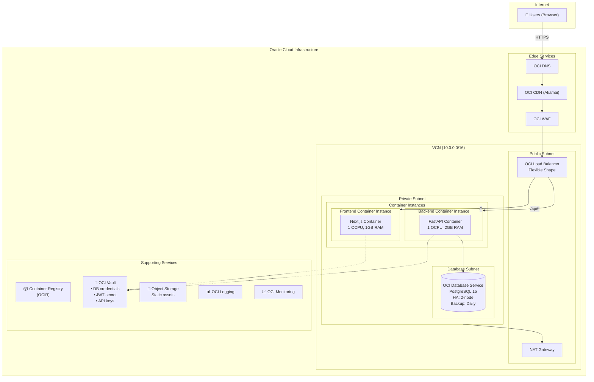
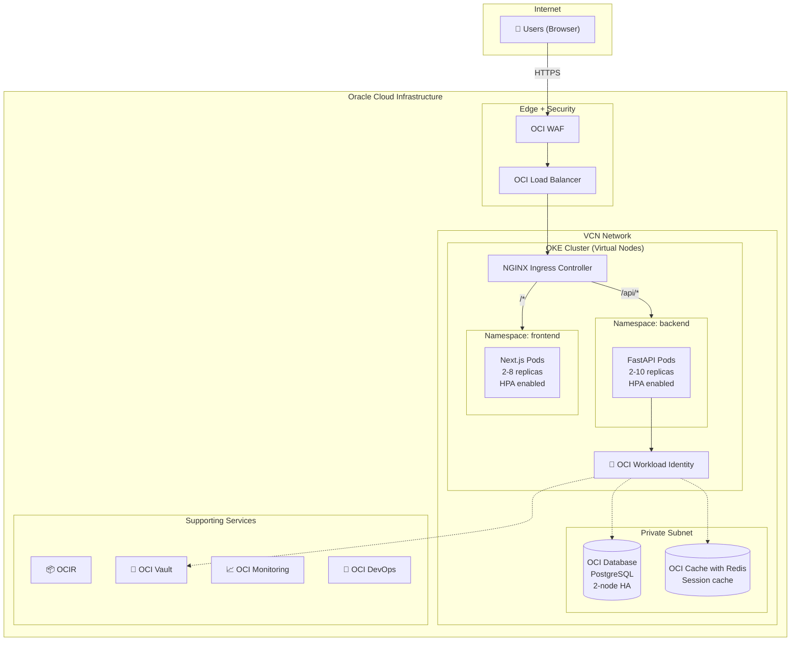
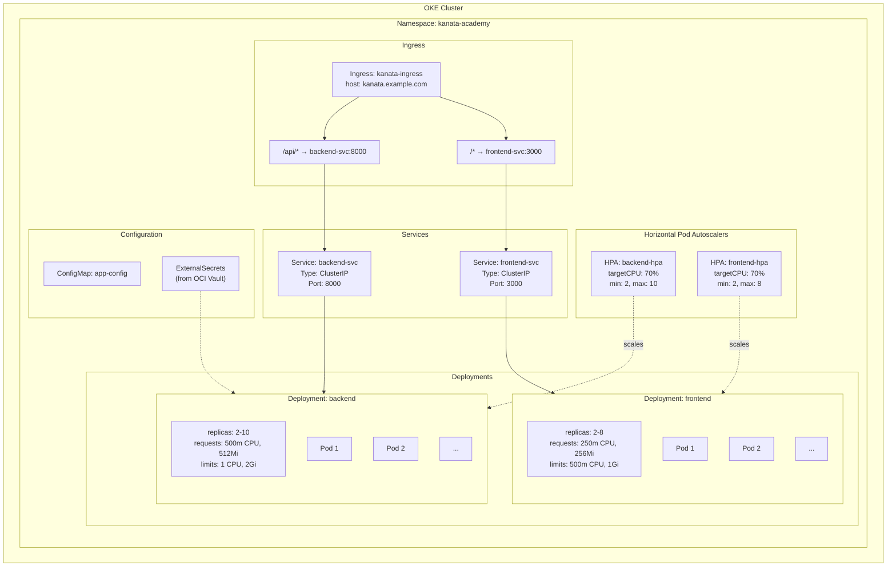
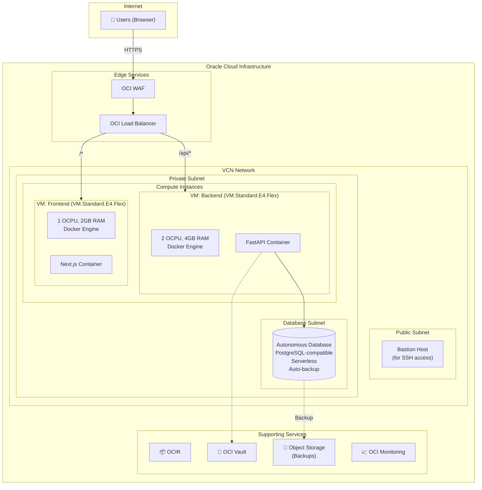

# KanataMusicAcademy - Oracle Cloud Infrastructure Architecture Design

## Executive Summary

This document presents three Oracle Cloud Infrastructure (OCI) architecture options for deploying the KanataMusicAcademy application, a music school management system consisting of a FastAPI backend and Next.js frontend with PostgreSQL database.

**Recommendation: Architecture 1 - OCI Container Instances** is the recommended approach for this application, providing the optimal balance of cost-efficiency, operational simplicity, and scalability for a small-to-medium business application.

---

## Application Profile

### Technology Stack
| Component | Technology | Version |
|-----------|------------|---------|
| Backend | FastAPI (Python) | 3.x |
| Frontend | Next.js | 16.1.6 |
| Database | PostgreSQL | 15+ |
| Authentication | JWT + bcrypt | - |
| UI Framework | React + Tailwind CSS | 19.x / 4.x |

### Application Characteristics
- **Traffic Pattern**: Variable, business hours peak (9 AM - 9 PM), low overnight
- **User Base**: Small-to-medium (50-500 concurrent users max)
- **Data Sensitivity**: Contains PII (student/teacher info, payment data)
- **Availability Requirement**: 99.5% uptime sufficient
- **Compliance**: Standard data protection practices

### Core Modules
1. **People Management** - Teachers, students, availability
2. **Class Scheduling** - Private/group lessons, calendar
3. **Payments** - Credit-based system, transactions
4. **Inventory** - Products, rentals, sales
5. **Dashboard** - Metrics and reporting
6. **User Administration** - RBAC (Admin/Teacher/Student)

---

## Architecture 1: OCI Container Instances - RECOMMENDED

### Overview
Serverless container architecture using OCI Container Instances for both frontend and backend, with OCI Database Service for managed PostgreSQL.

### Architecture Diagram



### Component Details

| Component | OCI Service | Configuration | Purpose |
|-----------|-------------|---------------|---------|
| Frontend | Container Instances | 1 OCPU, 1GB RAM | Next.js SSR |
| Backend | Container Instances | 1 OCPU, 2GB RAM | FastAPI API |
| Database | OCI Database PostgreSQL | 2 OCPU, 30GB | Data persistence |
| Load Balancer | Flexible Load Balancer | 10 Mbps | Traffic distribution |
| Secrets | OCI Vault | Master encryption key | Credentials storage |
| CDN | OCI CDN (Akamai) | Static asset caching | Performance |
| Security | OCI WAF | OWASP rules | DDoS protection |
| Monitoring | OCI Monitoring + Logging | Dashboards, alerts | Observability |
| Container Registry | OCIR | Docker images | CI/CD integration |

### Estimated Monthly Cost

| Resource | Specification | Monthly Cost (USD) |
|----------|--------------|-------------------|
| Container Instances (Backend) | 1 OCPU, 2GB RAM | $25-40 |
| Container Instances (Frontend) | 1 OCPU, 1GB RAM | $15-25 |
| OCI Database PostgreSQL | 2 OCPU, HA, 100GB | $150-200 |
| Flexible Load Balancer | 10 Mbps | $20 |
| OCI WAF | Standard | $15 |
| OCI CDN | 50GB egress | FREE (included) |
| OCI Vault | 1 master key, 5 secrets | $5 |
| Container Registry | 10GB storage | FREE (5GB free tier) |
| Object Storage | 10GB | FREE (10GB free tier) |
| NAT Gateway | Per-hour | $35 |
| **Total** | | **$265-340/month** |

### Pros
- **Cost-efficient**: Competitive OCI pricing, generous free tier
- **Simple deployment**: Container-based with minimal configuration
- **OCI integration**: Native integration with Vault, Logging, Monitoring
- **No cluster overhead**: Unlike OKE, no control plane costs
- **Fast startup**: Containers start in seconds

### Cons
- **Limited auto-scaling**: Manual scaling or custom automation needed
- **Fewer features**: Less mature than AWS ECS or GCP Cloud Run
- **Regional availability**: Container Instances not in all regions

---

## Architecture 2: Oracle Kubernetes Engine (OKE)

### Overview
Container orchestration platform using OKE with virtual node pools (serverless), providing Kubernetes capabilities with reduced operational overhead.

### Architecture Diagram



### Kubernetes Resource Diagram



### Estimated Monthly Cost

| Resource | Specification | Monthly Cost (USD) |
|----------|--------------|-------------------|
| OKE Control Plane | Enhanced cluster | FREE |
| Virtual Nodes | ~4 OCPUs, 8GB RAM average | $100-150 |
| OCI Database PostgreSQL | 2 OCPU, HA, 100GB | $150-200 |
| OCI Cache with Redis | 2GB | $40 |
| Flexible Load Balancer | 10 Mbps | $20 |
| OCI WAF | Standard | $15 |
| NAT Gateway | Per-hour | $35 |
| OCI Monitoring | Enhanced | $10 |
| **Total** | | **$370-470/month** |

### Pros
- **Free control plane**: OKE doesn't charge for cluster management
- **Kubernetes ecosystem**: Helm, ArgoCD, GitOps support
- **Virtual nodes**: Serverless pods, no node management
- **OCI integration**: Native IAM, Vault, Logging integration
- **Multi-tenancy**: Easy staging/production separation

### Cons
- **Complexity**: Kubernetes expertise required
- **Management overhead**: More YAML, more components
- **Overkill**: For a single music school application

---

## Architecture 3: Compute Instances with Docker

### Overview
Traditional IaaS approach using OCI Compute instances running Docker containers, with OCI Autonomous Database for managed PostgreSQL-compatible database.

### Architecture Diagram



### Estimated Monthly Cost

| Resource | Specification | Monthly Cost (USD) |
|----------|--------------|-------------------|
| Compute (Backend) | VM.Standard.E4.Flex, 2 OCPU, 4GB | $30 |
| Compute (Frontend) | VM.Standard.E4.Flex, 1 OCPU, 2GB | $15 |
| Autonomous Database | 2 OCPU, 100GB, Serverless | $180-250 |
| Flexible Load Balancer | 10 Mbps | $20 |
| OCI WAF | Standard | $15 |
| Object Storage | 50GB (backups) | $2 |
| Bastion Host | VM.Standard.E2.1.Micro | FREE (Always Free) |
| **Total** | | **$262-332/month** |

### Pros
- **Simple**: Traditional VM deployment model
- **Full control**: Complete OS and runtime access
- **Autonomous DB**: Zero-maintenance database with auto-scaling
- **Cost-effective**: OCI Compute is competitively priced
- **Always Free tier**: Bastion and some resources free forever

### Cons
- **Manual scaling**: No automatic horizontal scaling
- **OS maintenance**: Patching and updates required
- **Limited resilience**: Single VM per tier (unless duplicated)
- **Container overhead**: Manual Docker management

---

## Architecture Comparison Matrix

| Criteria | Container Instances | OKE | Compute + Docker |
|----------|---------------------|-----|------------------|
| **Monthly Cost** | $265-340 | $370-470 | $262-332 |
| **Scalability** | Manual | Excellent | Manual |
| **Auto-scaling** | No | Yes (HPA) | No |
| **Operational Complexity** | Low | High | Medium |
| **Startup Time** | Seconds | Ready (pods) | Ready (VMs) |
| **Database HA** | Managed | Managed | Managed |
| **Time to Deploy** | Hours | Weeks | Days |
| **Team Expertise Required** | Low | High (K8s) | Medium |
| **Flexibility** | Low | Very High | High |
| **Free Control Plane** | N/A | Yes | N/A |

---

## Recommended Architecture: Container Instances (Architecture 1)

### Justification

**OCI Container Instances is the optimal choice for KanataMusicAcademy** for the following reasons:

#### 1. Simplicity
- **No cluster management**: Unlike OKE, no Kubernetes expertise needed
- **Container-native**: Deploy Docker images directly
- **Minimal configuration**: Simple networking and security setup

#### 2. Cost Efficiency
- **Competitive pricing**: OCI Container Instances are well-priced
- **No control plane costs**: Unlike some managed Kubernetes services
- **Generous free tier**: Object Storage, some compute shapes free

#### 3. Right-Sized for the Application
- **Small-to-medium traffic**: A single music school fits Container Instances capacity
- **Predictable load**: Business hours traffic doesn't require aggressive auto-scaling
- **Simple architecture**: Two services don't need Kubernetes orchestration

#### 4. OCI Integration
- **OCI Vault**: Native secrets management
- **OCI Logging**: Centralized log collection
- **OCI Monitoring**: Metrics and alerting
- **OCIR**: Private container registry

#### 5. Oracle Database Advantage
- **OCI Database Service**: Enterprise PostgreSQL with HA
- **Autonomous option**: Self-patching, self-tuning database
- **Cost-effective**: Competitive with AWS RDS and Cloud SQL

### Mitigating Container Instances Limitations

| Limitation | Mitigation |
|------------|------------|
| No auto-scaling | Deploy multiple instances, use OCI Functions for spikes |
| Limited availability | Deploy across availability domains |
| Fewer features | Sufficient for this application's needs |

---

## Detailed Deployment Plan

### Phase 1: Foundation Setup (Day 1-2)

#### 1.1 OCI Tenancy Setup

```bash
# Set environment variables
export OCI_REGION="us-ashburn-1"
export OCI_COMPARTMENT_NAME="kanata-academy"
export OCI_TENANCY_ID="<your-tenancy-ocid>"

# Create compartment (via OCI CLI)
oci iam compartment create \
  --compartment-id $OCI_TENANCY_ID \
  --name $OCI_COMPARTMENT_NAME \
  --description "Kanata Music Academy Production"

# Get compartment OCID
export OCI_COMPARTMENT_ID=$(oci iam compartment list \
  --compartment-id $OCI_TENANCY_ID \
  --name $OCI_COMPARTMENT_NAME \
  --query 'data[0].id' --raw-output)
```

#### 1.2 VCN Network Setup

```bash
# Create VCN
VCN_ID=$(oci network vcn create \
  --compartment-id $OCI_COMPARTMENT_ID \
  --cidr-blocks '["10.0.0.0/16"]' \
  --display-name "${OCI_COMPARTMENT_NAME}-vcn" \
  --dns-label "kanatavcn" \
  --query 'data.id' --raw-output)

# Create Internet Gateway
IGW_ID=$(oci network internet-gateway create \
  --compartment-id $OCI_COMPARTMENT_ID \
  --vcn-id $VCN_ID \
  --is-enabled true \
  --display-name "${OCI_COMPARTMENT_NAME}-igw" \
  --query 'data.id' --raw-output)

# Create NAT Gateway
NAT_ID=$(oci network nat-gateway create \
  --compartment-id $OCI_COMPARTMENT_ID \
  --vcn-id $VCN_ID \
  --display-name "${OCI_COMPARTMENT_NAME}-nat" \
  --query 'data.id' --raw-output)

# Create Service Gateway (for OCI services)
SGW_ID=$(oci network service-gateway create \
  --compartment-id $OCI_COMPARTMENT_ID \
  --vcn-id $VCN_ID \
  --services '[{"serviceId": "all-iad-services-in-oracle-services-network"}]' \
  --display-name "${OCI_COMPARTMENT_NAME}-sgw" \
  --query 'data.id' --raw-output)

# Create Public Subnet
PUBLIC_SUBNET=$(oci network subnet create \
  --compartment-id $OCI_COMPARTMENT_ID \
  --vcn-id $VCN_ID \
  --cidr-block "10.0.1.0/24" \
  --display-name "${OCI_COMPARTMENT_NAME}-public-subnet" \
  --dns-label "public" \
  --prohibit-public-ip-on-vnic false \
  --query 'data.id' --raw-output)

# Create Private Subnet
PRIVATE_SUBNET=$(oci network subnet create \
  --compartment-id $OCI_COMPARTMENT_ID \
  --vcn-id $VCN_ID \
  --cidr-block "10.0.10.0/24" \
  --display-name "${OCI_COMPARTMENT_NAME}-private-subnet" \
  --dns-label "private" \
  --prohibit-public-ip-on-vnic true \
  --query 'data.id' --raw-output)

# Create Database Subnet
DB_SUBNET=$(oci network subnet create \
  --compartment-id $OCI_COMPARTMENT_ID \
  --vcn-id $VCN_ID \
  --cidr-block "10.0.20.0/24" \
  --display-name "${OCI_COMPARTMENT_NAME}-db-subnet" \
  --dns-label "database" \
  --prohibit-public-ip-on-vnic true \
  --query 'data.id' --raw-output)

# Create Route Tables
# Public Route Table
PUBLIC_RT=$(oci network route-table create \
  --compartment-id $OCI_COMPARTMENT_ID \
  --vcn-id $VCN_ID \
  --display-name "${OCI_COMPARTMENT_NAME}-public-rt" \
  --route-rules "[{\"destination\": \"0.0.0.0/0\", \"networkEntityId\": \"$IGW_ID\"}]" \
  --query 'data.id' --raw-output)

# Private Route Table
PRIVATE_RT=$(oci network route-table create \
  --compartment-id $OCI_COMPARTMENT_ID \
  --vcn-id $VCN_ID \
  --display-name "${OCI_COMPARTMENT_NAME}-private-rt" \
  --route-rules "[{\"destination\": \"0.0.0.0/0\", \"networkEntityId\": \"$NAT_ID\"}]" \
  --query 'data.id' --raw-output)

# Update subnet route tables
oci network subnet update --subnet-id $PUBLIC_SUBNET --route-table-id $PUBLIC_RT
oci network subnet update --subnet-id $PRIVATE_SUBNET --route-table-id $PRIVATE_RT
oci network subnet update --subnet-id $DB_SUBNET --route-table-id $PRIVATE_RT
```

#### 1.3 Security Lists / Network Security Groups

```bash
# Create NSG for Load Balancer
LB_NSG=$(oci network nsg create \
  --compartment-id $OCI_COMPARTMENT_ID \
  --vcn-id $VCN_ID \
  --display-name "${OCI_COMPARTMENT_NAME}-lb-nsg" \
  --query 'data.id' --raw-output)

# Allow HTTP/HTTPS ingress
oci network nsg-rules add \
  --nsg-id $LB_NSG \
  --security-rules '[
    {
      "direction": "INGRESS",
      "protocol": "6",
      "source": "0.0.0.0/0",
      "sourceType": "CIDR_BLOCK",
      "tcpOptions": {"destinationPortRange": {"min": 80, "max": 80}}
    },
    {
      "direction": "INGRESS",
      "protocol": "6",
      "source": "0.0.0.0/0",
      "sourceType": "CIDR_BLOCK",
      "tcpOptions": {"destinationPortRange": {"min": 443, "max": 443}}
    }
  ]'

# Create NSG for Containers
CONTAINER_NSG=$(oci network nsg create \
  --compartment-id $OCI_COMPARTMENT_ID \
  --vcn-id $VCN_ID \
  --display-name "${OCI_COMPARTMENT_NAME}-container-nsg" \
  --query 'data.id' --raw-output)

# Allow traffic from Load Balancer
oci network nsg-rules add \
  --nsg-id $CONTAINER_NSG \
  --security-rules "[
    {
      \"direction\": \"INGRESS\",
      \"protocol\": \"6\",
      \"source\": \"$LB_NSG\",
      \"sourceType\": \"NETWORK_SECURITY_GROUP\",
      \"tcpOptions\": {\"destinationPortRange\": {\"min\": 8000, \"max\": 8000}}
    },
    {
      \"direction\": \"INGRESS\",
      \"protocol\": \"6\",
      \"source\": \"$LB_NSG\",
      \"sourceType\": \"NETWORK_SECURITY_GROUP\",
      \"tcpOptions\": {\"destinationPortRange\": {\"min\": 3000, \"max\": 3000}}
    }
  ]"

# Create NSG for Database
DB_NSG=$(oci network nsg create \
  --compartment-id $OCI_COMPARTMENT_ID \
  --vcn-id $VCN_ID \
  --display-name "${OCI_COMPARTMENT_NAME}-db-nsg" \
  --query 'data.id' --raw-output)

# Allow PostgreSQL from Containers
oci network nsg-rules add \
  --nsg-id $DB_NSG \
  --security-rules "[
    {
      \"direction\": \"INGRESS\",
      \"protocol\": \"6\",
      \"source\": \"$CONTAINER_NSG\",
      \"sourceType\": \"NETWORK_SECURITY_GROUP\",
      \"tcpOptions\": {\"destinationPortRange\": {\"min\": 5432, \"max\": 5432}}
    }
  ]"
```

#### 1.4 Container Registry Setup

```bash
# Create repository in OCIR
# OCIR uses the format: <region-key>.ocir.io/<tenancy-namespace>/<repo-name>

# Get tenancy namespace
NAMESPACE=$(oci os ns get --query 'data' --raw-output)

# Repositories are created automatically on first push
# Configure Docker to authenticate with OCIR
docker login ${OCI_REGION}.ocir.io -u "${NAMESPACE}/oracleidentitycloudservice/<your-email>" -p "<auth-token>"
```

### Phase 2: Database Setup (Day 2-3)

#### 2.1 OCI Vault Setup

```bash
# Create Vault
VAULT_ID=$(oci kms management vault create \
  --compartment-id $OCI_COMPARTMENT_ID \
  --display-name "${OCI_COMPARTMENT_NAME}-vault" \
  --vault-type DEFAULT \
  --query 'data.id' --raw-output)

# Wait for vault to be active
oci kms management vault get --vault-id $VAULT_ID --query 'data."lifecycle-state"'

# Get vault management endpoint
VAULT_ENDPOINT=$(oci kms management vault get \
  --vault-id $VAULT_ID \
  --query 'data."management-endpoint"' --raw-output)

# Create master encryption key
KEY_ID=$(oci kms management key create \
  --compartment-id $OCI_COMPARTMENT_ID \
  --display-name "${OCI_COMPARTMENT_NAME}-master-key" \
  --key-shape '{"algorithm": "AES", "length": 32}' \
  --endpoint $VAULT_ENDPOINT \
  --query 'data.id' --raw-output)
```

#### 2.2 OCI Database Service (PostgreSQL)

```bash
# Generate and store password
DB_PASSWORD=$(openssl rand -base64 32)

# Store in Vault
oci vault secret create-base64 \
  --compartment-id $OCI_COMPARTMENT_ID \
  --vault-id $VAULT_ID \
  --key-id $KEY_ID \
  --secret-name "db-password" \
  --secret-content-content "$(echo -n $DB_PASSWORD | base64)"

# Create PostgreSQL Database System
DB_SYSTEM_ID=$(oci psql db-system create \
  --compartment-id $OCI_COMPARTMENT_ID \
  --display-name "${OCI_COMPARTMENT_NAME}-db" \
  --db-version "15" \
  --shape-name "PostgreSQL.VM.Standard.E4.Flex.2.32GB" \
  --instance-count 2 \
  --instance-memory-size-in-gbs 32 \
  --instance-ocpu-count 2 \
  --storage-details '{"systemType": "OCI_OPTIMIZED_STORAGE", "iops": 10000, "availabilityDomain": "AD-1"}' \
  --network-details "{\"subnetId\": \"$DB_SUBNET\", \"nsgIds\": [\"$DB_NSG\"]}" \
  --credentials "{\"username\": \"kanata_admin\", \"passwordDetails\": {\"passwordType\": \"PLAIN_TEXT\", \"password\": \"$DB_PASSWORD\"}}" \
  --query 'data.id' --raw-output)

# Wait for database to be available
oci psql db-system get --db-system-id $DB_SYSTEM_ID --query 'data."lifecycle-state"'

# Get database endpoint
DB_ENDPOINT=$(oci psql db-system get \
  --db-system-id $DB_SYSTEM_ID \
  --query 'data."primary-db-endpoint"."fqdn"' --raw-output)
```

#### 2.3 Store Secrets in Vault

```bash
# Store JWT secret
JWT_SECRET=$(openssl rand -base64 64)
oci vault secret create-base64 \
  --compartment-id $OCI_COMPARTMENT_ID \
  --vault-id $VAULT_ID \
  --key-id $KEY_ID \
  --secret-name "jwt-secret" \
  --secret-content-content "$(echo -n $JWT_SECRET | base64)"

# Store database URL
DATABASE_URL="postgresql://kanata_admin:${DB_PASSWORD}@${DB_ENDPOINT}:5432/kanata_academy"
oci vault secret create-base64 \
  --compartment-id $OCI_COMPARTMENT_ID \
  --vault-id $VAULT_ID \
  --key-id $KEY_ID \
  --secret-name "database-url" \
  --secret-content-content "$(echo -n $DATABASE_URL | base64)"
```

### Phase 3: Container Build (Day 3-4)

#### 3.1 Backend Dockerfile

Create `backend/Dockerfile`:

```dockerfile
# Build stage
FROM python:3.11-slim as builder

WORKDIR /app

# Install build dependencies
RUN apt-get update && apt-get install -y \
    gcc \
    libpq-dev \
    && rm -rf /var/lib/apt/lists/*

# Install Python dependencies
COPY requirements.txt .
RUN pip install --no-cache-dir --user -r requirements.txt

# Production stage
FROM python:3.11-slim

WORKDIR /app

# Install runtime dependencies
RUN apt-get update && apt-get install -y \
    libpq5 \
    curl \
    && rm -rf /var/lib/apt/lists/*

# Copy installed packages from builder
COPY --from=builder /root/.local /root/.local
ENV PATH=/root/.local/bin:$PATH

# Copy application code
COPY . .

# Health check
HEALTHCHECK --interval=30s --timeout=3s --start-period=5s --retries=3 \
  CMD curl -f http://localhost:8000/health || exit 1

# Run the application
ENV PORT=8000
EXPOSE 8000

CMD exec uvicorn main:app --host 0.0.0.0 --port $PORT --workers 2
```

#### 3.2 Frontend Dockerfile

Create `frontend/Dockerfile`:

```dockerfile
# Build stage
FROM node:20-alpine AS builder

WORKDIR /app

# Copy package files
COPY package*.json ./

# Install dependencies
RUN npm ci

# Copy application code
COPY . .

# Set production environment
ENV NODE_ENV=production
ENV NEXT_TELEMETRY_DISABLED=1

# Build the application
RUN npm run build

# Production stage
FROM node:20-alpine AS runner

WORKDIR /app

ENV NODE_ENV=production
ENV NEXT_TELEMETRY_DISABLED=1

# Add non-root user
RUN addgroup --system --gid 1001 nodejs
RUN adduser --system --uid 1001 nextjs

# Install curl for health checks
RUN apk add --no-cache curl

# Copy built application
COPY --from=builder /app/public ./public
COPY --from=builder --chown=nextjs:nodejs /app/.next/standalone ./
COPY --from=builder --chown=nextjs:nodejs /app/.next/static ./.next/static

USER nextjs

HEALTHCHECK --interval=30s --timeout=3s --start-period=5s --retries=3 \
  CMD curl -f http://localhost:3000/ || exit 1

EXPOSE 3000
ENV PORT=3000

CMD ["node", "server.js"]
```

#### 3.3 Build and Push Images

```bash
# Build and push backend
docker build -t ${OCI_REGION}.ocir.io/${NAMESPACE}/kanata-academy/backend:latest ./backend
docker push ${OCI_REGION}.ocir.io/${NAMESPACE}/kanata-academy/backend:latest

# Build and push frontend
docker build -t ${OCI_REGION}.ocir.io/${NAMESPACE}/kanata-academy/frontend:latest ./frontend
docker push ${OCI_REGION}.ocir.io/${NAMESPACE}/kanata-academy/frontend:latest
```

### Phase 4: Container Instances Deployment (Day 4-5)

#### 4.1 Create Dynamic Group and Policies

```bash
# Create dynamic group for container instances
oci iam dynamic-group create \
  --compartment-id $OCI_TENANCY_ID \
  --name "${OCI_COMPARTMENT_NAME}-containers" \
  --description "Container Instances for Kanata Academy" \
  --matching-rule "ALL {resource.type='computecontainerinstance', resource.compartment.id='$OCI_COMPARTMENT_ID'}"

# Create policy for Vault access
oci iam policy create \
  --compartment-id $OCI_COMPARTMENT_ID \
  --name "${OCI_COMPARTMENT_NAME}-container-policy" \
  --description "Allow containers to access vault secrets" \
  --statements '[
    "Allow dynamic-group kanata-academy-containers to read secret-family in compartment kanata-academy",
    "Allow dynamic-group kanata-academy-containers to use keys in compartment kanata-academy"
  ]'
```

#### 4.2 Deploy Backend Container Instance

```bash
# Create backend container instance
BACKEND_CI=$(oci container-instances container-instance create \
  --compartment-id $OCI_COMPARTMENT_ID \
  --availability-domain "${OCI_REGION}:AD-1" \
  --shape "CI.Standard.E4.Flex" \
  --shape-config '{"ocpus": 1, "memoryInGBs": 2}' \
  --display-name "${OCI_COMPARTMENT_NAME}-backend" \
  --containers "[{
    \"displayName\": \"backend\",
    \"imageUrl\": \"${OCI_REGION}.ocir.io/${NAMESPACE}/kanata-academy/backend:latest\",
    \"environmentVariables\": {
      \"ENVIRONMENT\": \"production\",
      \"DATABASE_URL\": \"$DATABASE_URL\",
      \"JWT_SECRET\": \"$JWT_SECRET\"
    },
    \"healthChecks\": [{
      \"healthCheckType\": \"HTTP\",
      \"port\": 8000,
      \"path\": \"/health\",
      \"intervalInSeconds\": 30
    }]
  }]" \
  --vnics "[{\"subnetId\": \"$PRIVATE_SUBNET\", \"nsgIds\": [\"$CONTAINER_NSG\"]}]" \
  --query 'data.id' --raw-output)

# Get backend IP
BACKEND_IP=$(oci container-instances container-instance get \
  --container-instance-id $BACKEND_CI \
  --query 'data.vnics[0]."private-ip"' --raw-output)
```

#### 4.3 Deploy Frontend Container Instance

```bash
# Create frontend container instance
FRONTEND_CI=$(oci container-instances container-instance create \
  --compartment-id $OCI_COMPARTMENT_ID \
  --availability-domain "${OCI_REGION}:AD-1" \
  --shape "CI.Standard.E4.Flex" \
  --shape-config '{"ocpus": 1, "memoryInGBs": 1}' \
  --display-name "${OCI_COMPARTMENT_NAME}-frontend" \
  --containers "[{
    \"displayName\": \"frontend\",
    \"imageUrl\": \"${OCI_REGION}.ocir.io/${NAMESPACE}/kanata-academy/frontend:latest\",
    \"environmentVariables\": {
      \"NEXT_PUBLIC_API_URL\": \"https://kanata-academy.com/api\"
    },
    \"healthChecks\": [{
      \"healthCheckType\": \"HTTP\",
      \"port\": 3000,
      \"path\": \"/\",
      \"intervalInSeconds\": 30
    }]
  }]" \
  --vnics "[{\"subnetId\": \"$PRIVATE_SUBNET\", \"nsgIds\": [\"$CONTAINER_NSG\"]}]" \
  --query 'data.id' --raw-output)

# Get frontend IP
FRONTEND_IP=$(oci container-instances container-instance get \
  --container-instance-id $FRONTEND_CI \
  --query 'data.vnics[0]."private-ip"' --raw-output)
```

### Phase 5: Load Balancer Setup (Day 5)

#### 5.1 Create Load Balancer

```bash
# Create flexible load balancer
LB_ID=$(oci lb load-balancer create \
  --compartment-id $OCI_COMPARTMENT_ID \
  --display-name "${OCI_COMPARTMENT_NAME}-lb" \
  --shape-name "flexible" \
  --shape-details '{"minimumBandwidthInMbps": 10, "maximumBandwidthInMbps": 100}' \
  --subnet-ids "[\"$PUBLIC_SUBNET\"]" \
  --network-security-group-ids "[\"$LB_NSG\"]" \
  --is-private false \
  --query 'data.id' --raw-output)

# Wait for LB to be active
oci lb load-balancer get --load-balancer-id $LB_ID --query 'data."lifecycle-state"'

# Get LB IP
LB_IP=$(oci lb load-balancer get \
  --load-balancer-id $LB_ID \
  --query 'data."ip-addresses"[0]."ip-address"' --raw-output)
```

#### 5.2 Configure Backend Sets

```bash
# Create backend set for API
oci lb backend-set create \
  --load-balancer-id $LB_ID \
  --name "backend-set" \
  --policy "ROUND_ROBIN" \
  --health-checker-protocol "HTTP" \
  --health-checker-port 8000 \
  --health-checker-url-path "/health" \
  --health-checker-interval-in-millis 30000 \
  --health-checker-timeout-in-millis 3000 \
  --health-checker-retries 3

# Add backend to backend set
oci lb backend create \
  --load-balancer-id $LB_ID \
  --backend-set-name "backend-set" \
  --ip-address $BACKEND_IP \
  --port 8000

# Create backend set for Frontend
oci lb backend-set create \
  --load-balancer-id $LB_ID \
  --name "frontend-set" \
  --policy "ROUND_ROBIN" \
  --health-checker-protocol "HTTP" \
  --health-checker-port 3000 \
  --health-checker-url-path "/" \
  --health-checker-interval-in-millis 30000 \
  --health-checker-timeout-in-millis 3000 \
  --health-checker-retries 3

# Add frontend backend
oci lb backend create \
  --load-balancer-id $LB_ID \
  --backend-set-name "frontend-set" \
  --ip-address $FRONTEND_IP \
  --port 3000
```

#### 5.3 Configure Listeners and Routing

```bash
# Create SSL certificate (or use OCI Certificates Service)
# For this example, assuming certificate is already created
CERT_ID="<certificate-ocid>"

# Create HTTPS listener
oci lb listener create \
  --load-balancer-id $LB_ID \
  --name "https-listener" \
  --default-backend-set-name "frontend-set" \
  --port 443 \
  --protocol "HTTP" \
  --ssl-certificate-ids "[\"$CERT_ID\"]"

# Create routing policy for API
oci lb routing-policy create \
  --load-balancer-id $LB_ID \
  --name "api-routing" \
  --condition-language-version "V1" \
  --rules '[
    {
      "name": "api-rule",
      "condition": "any(http.request.url.path sw (i \"/api\"), http.request.url.path eq (i \"/token\"))",
      "actions": [{
        "name": "FORWARD_TO_BACKENDSET",
        "backendSetName": "backend-set"
      }]
    }
  ]'

# Update listener with routing policy
oci lb listener update \
  --load-balancer-id $LB_ID \
  --listener-name "https-listener" \
  --routing-policy-name "api-routing"

# Create HTTP to HTTPS redirect
oci lb listener create \
  --load-balancer-id $LB_ID \
  --name "http-redirect" \
  --default-backend-set-name "frontend-set" \
  --port 80 \
  --protocol "HTTP"

# Add redirect rule set
oci lb rule-set create \
  --load-balancer-id $LB_ID \
  --name "http-redirect-rules" \
  --items '[{
    "action": "REDIRECT",
    "responseCode": 301,
    "redirectUri": {
      "protocol": "HTTPS",
      "port": 443,
      "host": "{host}",
      "path": "{path}",
      "query": "{query}"
    },
    "conditions": [{
      "attributeName": "PATH",
      "attributeValue": "/",
      "operator": "PREFIX_MATCH"
    }]
  }]'

oci lb listener update \
  --load-balancer-id $LB_ID \
  --listener-name "http-redirect" \
  --rule-set-names '["http-redirect-rules"]'
```

### Phase 6: WAF and DNS (Day 6)

#### 6.1 OCI WAF Setup

```bash
# Create WAF policy
WAF_POLICY=$(oci waf web-app-firewall-policy create \
  --compartment-id $OCI_COMPARTMENT_ID \
  --display-name "${OCI_COMPARTMENT_NAME}-waf" \
  --actions '[
    {"name": "defaultAction", "type": "ALLOW"},
    {"name": "blockAction", "type": "RETURN_HTTP_RESPONSE", "code": 403, "body": {"type": "STATIC_TEXT", "text": "Blocked by WAF"}}
  ]' \
  --request-access-control '{
    "defaultActionName": "defaultAction",
    "rules": [
      {
        "name": "SQLiProtection",
        "type": "PROTECTION",
        "actionName": "blockAction",
        "condition": "i_contains(http.request.url.query_string, '\''or 1=1'\'')"
      }
    ]
  }' \
  --request-rate-limiting '{
    "rules": [{
      "name": "RateLimit",
      "type": "REQUEST_RATE_LIMITING",
      "actionName": "blockAction",
      "configurations": [{
        "periodInSeconds": 60,
        "requestsLimit": 100
      }]
    }]
  }' \
  --query 'data.id' --raw-output)

# Create WAF
oci waf web-app-firewall create \
  --compartment-id $OCI_COMPARTMENT_ID \
  --display-name "${OCI_COMPARTMENT_NAME}-waf" \
  --backend-type "LOAD_BALANCER" \
  --load-balancer-id $LB_ID \
  --web-app-firewall-policy-id $WAF_POLICY
```

#### 6.2 DNS Configuration

```bash
# Create DNS zone
ZONE_ID=$(oci dns zone create \
  --compartment-id $OCI_COMPARTMENT_ID \
  --name "kanata-academy.com" \
  --zone-type "PRIMARY" \
  --query 'data.id' --raw-output)

# Create A record pointing to load balancer
oci dns record domain patch \
  --zone-name-or-id $ZONE_ID \
  --domain "kanata-academy.com" \
  --items "[{
    \"domain\": \"kanata-academy.com\",
    \"rtype\": \"A\",
    \"ttl\": 300,
    \"rdata\": \"$LB_IP\"
  }]"

# Create www CNAME
oci dns record domain patch \
  --zone-name-or-id $ZONE_ID \
  --domain "www.kanata-academy.com" \
  --items "[{
    \"domain\": \"www.kanata-academy.com\",
    \"rtype\": \"CNAME\",
    \"ttl\": 300,
    \"rdata\": \"kanata-academy.com\"
  }]"
```

### Phase 7: Monitoring & Alerting (Day 7)

#### 7.1 OCI Logging Setup

```bash
# Create log group
LOG_GROUP=$(oci logging log-group create \
  --compartment-id $OCI_COMPARTMENT_ID \
  --display-name "${OCI_COMPARTMENT_NAME}-logs" \
  --query 'data.id' --raw-output)

# Create log for container instances
oci logging log create \
  --log-group-id $LOG_GROUP \
  --display-name "container-logs" \
  --log-type "SERVICE" \
  --configuration '{
    "compartmentId": "'$OCI_COMPARTMENT_ID'",
    "source": {
      "category": "all",
      "resource": "'$BACKEND_CI'",
      "service": "containerinstance",
      "sourceType": "OCISERVICE"
    }
  }'
```

#### 7.2 OCI Monitoring Alarms

```bash
# Create alarm for high CPU
oci monitoring alarm create \
  --compartment-id $OCI_COMPARTMENT_ID \
  --display-name "${OCI_COMPARTMENT_NAME}-high-cpu" \
  --metric-compartment-id $OCI_COMPARTMENT_ID \
  --namespace "oci_computecontainerinstance" \
  --query-text "CpuUtilization[1m].mean() > 80" \
  --severity "CRITICAL" \
  --body "Container instance CPU exceeds 80%" \
  --is-enabled true \
  --pending-duration "PT5M" \
  --destinations "[\"$NOTIFICATION_TOPIC\"]"

# Create alarm for LB errors
oci monitoring alarm create \
  --compartment-id $OCI_COMPARTMENT_ID \
  --display-name "${OCI_COMPARTMENT_NAME}-lb-errors" \
  --metric-compartment-id $OCI_COMPARTMENT_ID \
  --namespace "oci_lbaas" \
  --query-text "HttpResponses[1m]{backendSetName=\"backend-set\", statusCode=\"5*\"}.sum() > 10" \
  --severity "WARNING" \
  --body "Load balancer experiencing 5xx errors" \
  --is-enabled true \
  --pending-duration "PT5M" \
  --destinations "[\"$NOTIFICATION_TOPIC\"]"

# Create alarm for database
oci monitoring alarm create \
  --compartment-id $OCI_COMPARTMENT_ID \
  --display-name "${OCI_COMPARTMENT_NAME}-db-cpu" \
  --metric-compartment-id $OCI_COMPARTMENT_ID \
  --namespace "oci_postgresql_database" \
  --query-text "CpuUtilization[5m].mean() > 80" \
  --severity "CRITICAL" \
  --body "Database CPU exceeds 80%" \
  --is-enabled true \
  --pending-duration "PT5M" \
  --destinations "[\"$NOTIFICATION_TOPIC\"]"
```

### Phase 8: CI/CD Pipeline (Day 8)

#### 8.1 OCI DevOps Setup

```bash
# Create DevOps project
DEVOPS_PROJECT=$(oci devops project create \
  --compartment-id $OCI_COMPARTMENT_ID \
  --name "${OCI_COMPARTMENT_NAME}-devops" \
  --notification-config '{"topicId": "'$NOTIFICATION_TOPIC'"}' \
  --query 'data.id' --raw-output)

# Create artifact repository
oci devops repository create \
  --project-id $DEVOPS_PROJECT \
  --name "kanata-academy" \
  --repository-type "HOSTED" \
  --default-branch "main"
```

#### 8.2 GitHub Actions (Alternative)

Create `.github/workflows/deploy-oci.yml`:

```yaml
name: Deploy to OCI

on:
  push:
    branches: [main, develop]
  pull_request:
    branches: [main]

env:
  OCI_REGION: us-ashburn-1
  OCIR_NAMESPACE: ${{ secrets.OCI_NAMESPACE }}

jobs:
  test:
    runs-on: ubuntu-latest
    steps:
      - uses: actions/checkout@v4

      - name: Set up Python
        uses: actions/setup-python@v5
        with:
          python-version: '3.11'

      - name: Install backend dependencies
        run: |
          cd backend
          pip install -r requirements.txt
          pip install pytest pytest-cov

      - name: Run backend tests
        run: |
          cd backend
          pytest tests/ -v --cov=.

      - name: Set up Node.js
        uses: actions/setup-node@v4
        with:
          node-version: '20'
          cache: 'npm'
          cache-dependency-path: frontend/package-lock.json

      - name: Install frontend dependencies
        run: |
          cd frontend
          npm ci

      - name: Run frontend lint
        run: |
          cd frontend
          npm run lint

      - name: Build frontend
        run: |
          cd frontend
          npm run build

  deploy:
    needs: test
    if: github.ref == 'refs/heads/main' || github.ref == 'refs/heads/develop'
    runs-on: ubuntu-latest

    steps:
      - uses: actions/checkout@v4

      - name: Configure OCI CLI
        uses: oracle-actions/configure-oci-cli@v1
        with:
          user: ${{ secrets.OCI_USER_OCID }}
          fingerprint: ${{ secrets.OCI_FINGERPRINT }}
          tenancy: ${{ secrets.OCI_TENANCY_OCID }}
          region: ${{ env.OCI_REGION }}
          api_key: ${{ secrets.OCI_API_KEY }}

      - name: Login to OCIR
        run: |
          echo ${{ secrets.OCI_AUTH_TOKEN }} | docker login ${{ env.OCI_REGION }}.ocir.io -u "${{ env.OCIR_NAMESPACE }}/oracleidentitycloudservice/${{ secrets.OCI_USER_EMAIL }}" --password-stdin

      - name: Build and push backend
        run: |
          docker build -t ${{ env.OCI_REGION }}.ocir.io/${{ env.OCIR_NAMESPACE }}/kanata-academy/backend:${{ github.sha }} -f backend/Dockerfile ./backend
          docker push ${{ env.OCI_REGION }}.ocir.io/${{ env.OCIR_NAMESPACE }}/kanata-academy/backend:${{ github.sha }}

      - name: Build and push frontend
        run: |
          docker build -t ${{ env.OCI_REGION }}.ocir.io/${{ env.OCIR_NAMESPACE }}/kanata-academy/frontend:${{ github.sha }} -f frontend/Dockerfile ./frontend
          docker push ${{ env.OCI_REGION }}.ocir.io/${{ env.OCIR_NAMESPACE }}/kanata-academy/frontend:${{ github.sha }}

      - name: Restart container instances
        run: |
          # Restart backend container instance
          oci container-instances container-instance restart \
            --container-instance-id ${{ secrets.BACKEND_CI_ID }}

          # Restart frontend container instance
          oci container-instances container-instance restart \
            --container-instance-id ${{ secrets.FRONTEND_CI_ID }}
```

---

## Post-Deployment Checklist

### Functionality Verification
- [ ] Frontend loads at https://kanata-academy.com
- [ ] API responds at https://kanata-academy.com/api/
- [ ] Authentication (/token endpoint) works
- [ ] Database connections successful
- [ ] All CRUD operations functional

### Security Verification
- [ ] HTTPS enforced (HTTP redirects to HTTPS)
- [ ] SSL certificate valid
- [ ] WAF rules active
- [ ] Vault secrets accessible only by container instances
- [ ] NSGs properly restrict traffic

### Monitoring Verification
- [ ] OCI Logging receiving logs
- [ ] Monitoring dashboards showing metrics
- [ ] Alarms configured
- [ ] Notifications tested

### Backup Verification
- [ ] Database automated backups enabled
- [ ] Point-in-time recovery available
- [ ] Manual backup tested

---

## Cost Optimization Tips

1. **Always Free resources**: Use Always Free tier for bastion, object storage
2. **Flexible shapes**: Right-size OCPUs and memory for actual usage
3. **Preemptible instances**: Use for development/testing workloads
4. **Reserved capacity**: Consider annual commitments for 40%+ savings
5. **Object Storage tiers**: Use Archive tier for old backups
6. **Service Gateway**: Avoid NAT charges for OCI service traffic

---

## Disaster Recovery

### RTO/RPO Targets
- **RTO (Recovery Time Objective)**: 1 hour
- **RPO (Recovery Point Objective)**: 15 minutes (database backups)

### Recovery Procedures

1. **Container failure**: Container Instances automatically restart failed containers
2. **Database failure**: 2-node HA provides automatic failover
3. **Region failure**: Deploy to alternate region using stored container images
4. **Data corruption**: Restore from point-in-time backup

### Backup Schedule
- **Database**: Automatic daily backups (retained 30 days)
- **Container images**: Stored in OCIR with versioning
- **Configuration**: Infrastructure as Code in version control
- **Secrets**: Vault with cross-region replication

---

## Appendix: Environment Variables

### Backend Container
| Variable | Source | Description |
|----------|--------|-------------|
| `DATABASE_URL` | OCI Vault | PostgreSQL connection string |
| `JWT_SECRET` | OCI Vault | JWT signing key |
| `ENVIRONMENT` | Container config | `production` or `staging` |
| `CORS_ORIGINS` | Container config | Allowed CORS origins |

### Frontend Container
| Variable | Source | Description |
|----------|--------|-------------|
| `NEXT_PUBLIC_API_URL` | Container config | Backend API URL |
| `NODE_ENV` | Docker build | `production` |

---

*Document Version: 1.0*
*Last Updated: 2026-03-22*
*Author: Claude Code (Cloud Architect)*
