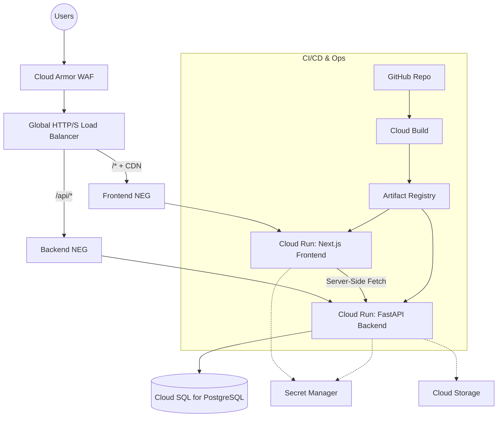
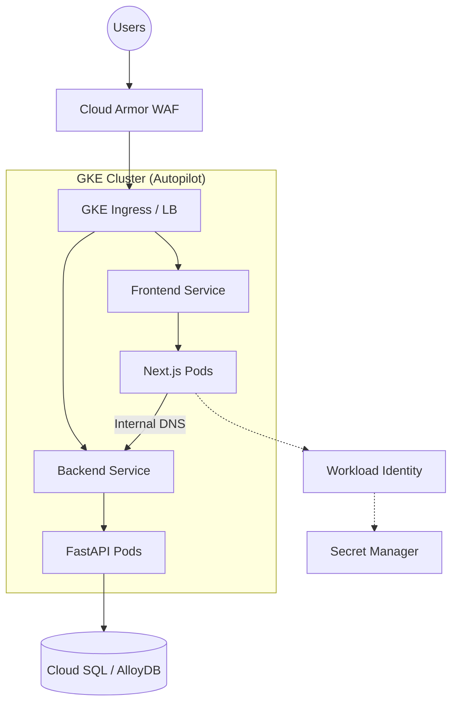
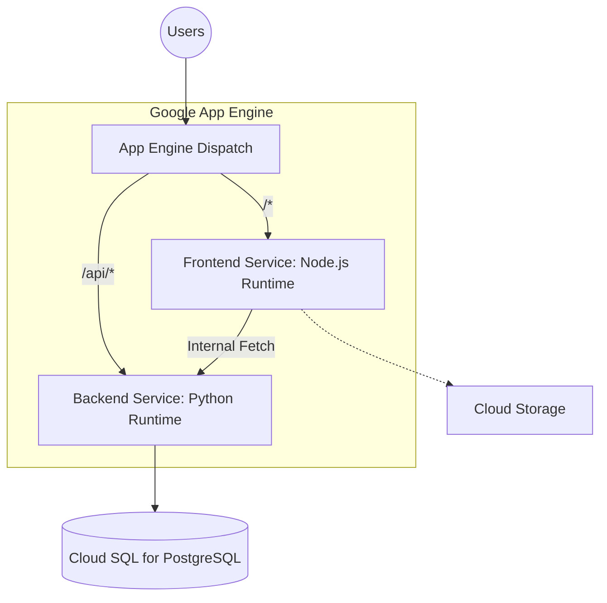

# KanataMusicAcademy: Google Cloud Platform Architecture Design

This document details three potential GCP architectures for deploying the KanataMusicAcademy application, which consists of a **Next.js** frontend, a **FastAPI** backend, and a **PostgreSQL** database.

## 1. Top 3 Architecture Variations

### Architecture 1: Fully Serverless Containerized (Cloud Run) - 🏆 RECOMMENDED
This modern approach leverages Google Cloud Run to deploy stateless Docker containers in a fully serverless environment, paired with managed database services.

**Pros:**
- **Zero Server Management**: No underlying infrastructure to patch or manage.
- **Pay-per-use & Scale-to-zero**: Highly cost-effective; automatically scales up during class registrations and down to zero at night.
- **Container Portability**: Standard Dockerfiles ensure local development parity and avoid vendor lock-in.

**Cons:**
- **Cold Starts**: Initial requests after idle periods may experience latency (easily mitigated using Cloud Run's CPU Always-on or Minimum Instances).

---

### Architecture 2: Container Orchestration (GKE Autopilot)
For extreme scalability, granular microservice control, and expansive ecosystem tooling, Google Kubernetes Engine (GKE) is the enterprise standard.

**Pros:**
- **Absolute Control**: Complex networking, service mesh, and background long-running workers are fully supported.
- **High Resource Efficiency**: Packs multiple containers onto nodes (Abstracted gracefully by GKE Autopilot).

**Cons:**
- **High Complexity**: Vastly steeper learning curve requiring Kubernetes expertise.
- **Overkill**: Unnecessary operational overhead for a standard two-tier web application.
- **Base Costs**: The cluster control plane incurs baseline costs even with zero traffic.

---

### Architecture 3: Managed PaaS (App Engine Standard/Flexible)
Using Google's traditional Platform-as-a-Service model to directly deploy code rather than containers.

**Pros:**
- **Simplicity**: Code-centric deployment (`gcloud app deploy`) without needing to write or optimize Dockerfiles.
- **Built-in Traffic Splitting**: Excellent tools for A/B testing and canary deployments.

**Cons:**
- **Legacy Service Limitations**: Standard environment has restrictive file system access and system dependency limitations.
- **Vendor Lock-in**: Code requires App Engine specific configurations (`app.yaml`).
- **Slower Deployments**: Building and deploying directly from source typically takes longer than pulling a pre-computed container image in Cloud Run.

---

## 2. Selection & Justification

**Selected Architecture: Architecture 1 (Cloud Run + Cloud SQL)**

**Justification:**
1. **Right-Sized for the Application:** KanataMusicAcademy is a standard full-stack application (Next.js + FastAPI + Postgres). It does not currently warrant the extreme complexity of K8s/GKE, nor the restrictive runtime limitations of App Engine.
2. **Cost Optimization:** For a regional music academy, traffic will likely be highly cyclical (spikes during enrollment, active during day/evening, dead at night). Cloud Run's ability to scale precisely to traffic and scale to zero ensures you are not paying for idle compute overnight. 
3. **Developer Velocity:** Since the application is already decoupled into frontend and backend directories, generating Dockerfiles and using Cloud Run ensures that what developers run locally via Docker Compose behaves identically in production.
4. **Security & Performance:** By fronting Cloud Run with an External HTTP(S) Load Balancer, we get Cloud CDN for edge-caching frontend assets and Cloud Armor for DDoS and WAF protection out-of-the-box.

---

## 3. Detailed Deployment Plan (Cloud Run Architecture)

### Phase 1: Foundation & Security
1. **Project Setup**: Ensure a dedicated GCP Project is created and billing is enabled.
2. **Enable APIs**: Enable Cloud Run, Cloud SQL, Compute Engine, Secret Manager, Cloud Build, and Artifact Registry APIs.
3. **Secret Management**:
   - Store highly sensitive credentials in **Secret Manager**:
     - `POSTGRES_PASSWORD`
     - `JWT_SECRET_KEY`
     - Third-party API Keys (e.g., SMTP credentials for email service).

### Phase 2: Database Provisioning
1. **VPC Network**: Create a custom VPC Network with a Serverless VPC Access Connector (or use the newer Direct VPC Egress).
2. **Cloud SQL**: 
   - Provision a PostgreSQL 15+ instance.
   - Configure it with a Private IP within the created VPC (disable public IP for security).
   - Set up automated daily backups and high availability (Multi-zone) if treating this environment as Production.
   - Run the initial database seeding script (`python -m backend.seed_db`) via a temporary VM or via Cloud Build.

### Phase 3: Containerization & Registry
1. **Dockerize**: Add a `Dockerfile` to `/backend` (Python + Uvicorn) and `/frontend` (Node + Next.js standalone build).
2. **Artifact Registry**: Create a Docker repository in your desired region (e.g., `us-east4` or `northamerica-northeast1` for Canada).
3. **CI/CD Pipeline (Cloud Build)**:
   - Connect the GitHub repository to Cloud Build.
   - Create a `cloudbuild.yaml` file to automate testing, building container images, pushing to Artifact Registry, and deploying to Cloud Run upon main branch merges.

### Phase 4: Compute Deployment (Cloud Run)
1. **Deploy Backend**:
   - Deploy the FastAPI container.
   - Configure direct VPC Egress so it can communicate securely with the private Cloud SQL instance.
   - Inject environment variables pointing to DB using Secret Manager references.
2. **Deploy Frontend**:
   - Deploy the Next.js container.
   - Supply the backend URL to the frontend environment variables (`NEXT_PUBLIC_API_URL`).

### Phase 5: Routing, Domain & Edge Security
1. **Serverless NEGs**: Create Serverless Network Endpoint Groups for both Cloud Run services.
2. **Load Balancer**: Setup a Global External Application Load Balancer.
   - Route `/api/*` to the Backend NEG.
   - Route `/*` (default) to the Frontend NEG.
3. **Cloud CDN**: Enable Cloud CDN on the Frontend backend service to cache static Next.js assets (`/_next/static/*`).
4. **Cloud Armor**: Attach a default Web Application Firewall (WAF) policy protecting against SQLi and XSS.
5. **Custom Domain**: Map the academy's domain to the Load Balancer IP and use a Google-managed SSL Certificate.
